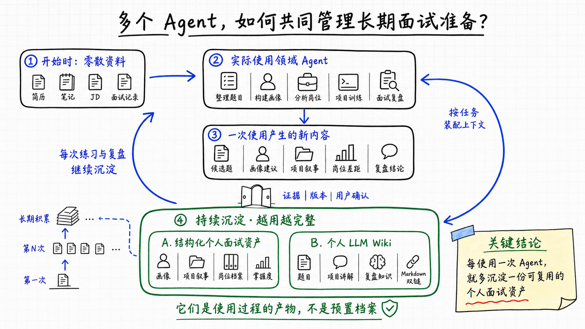
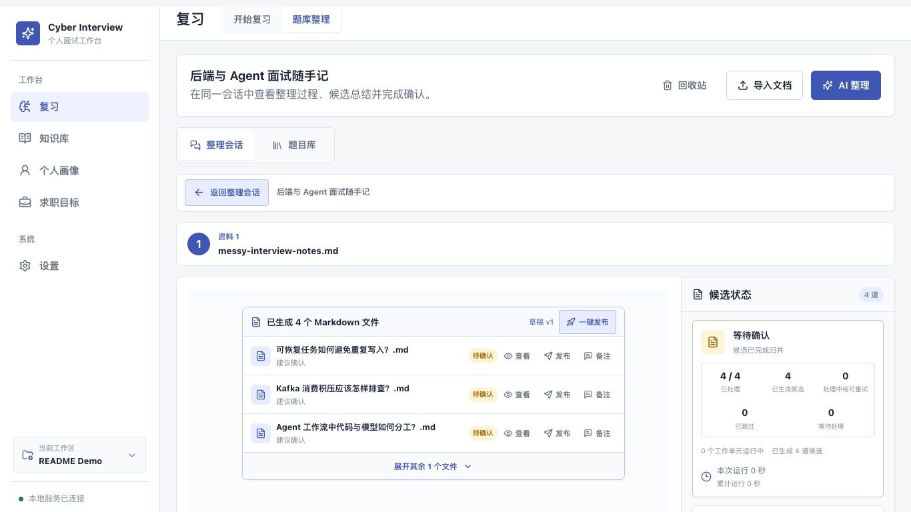
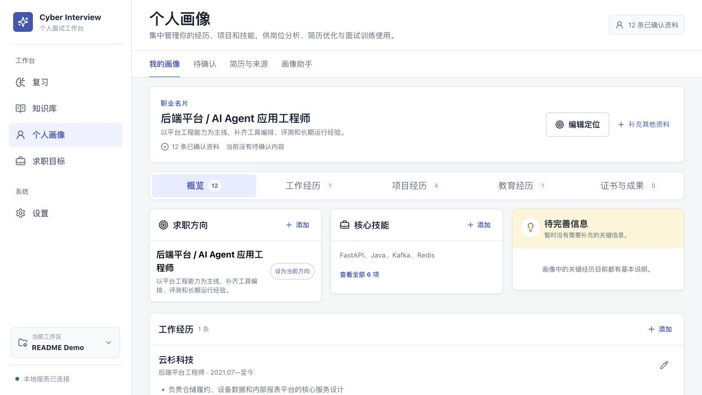
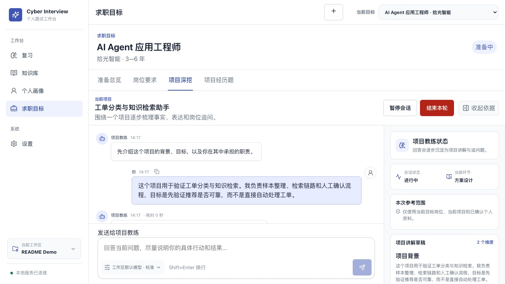
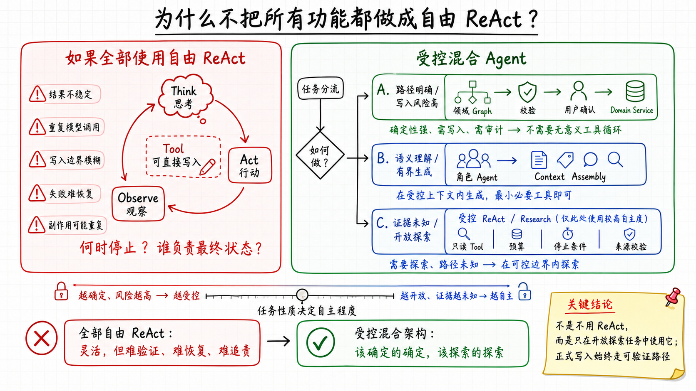
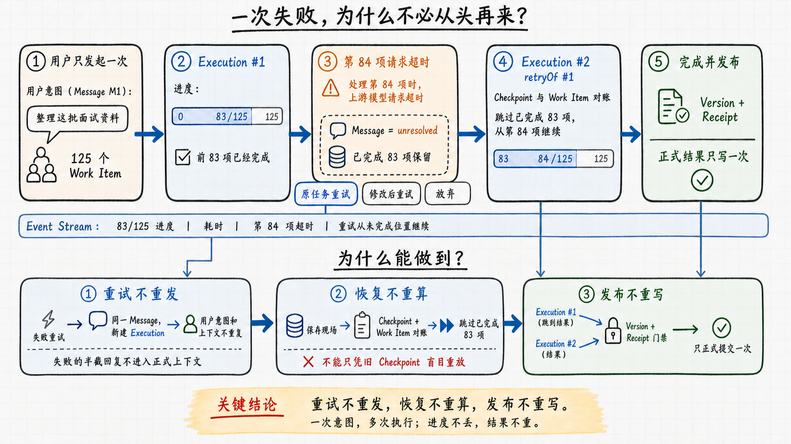
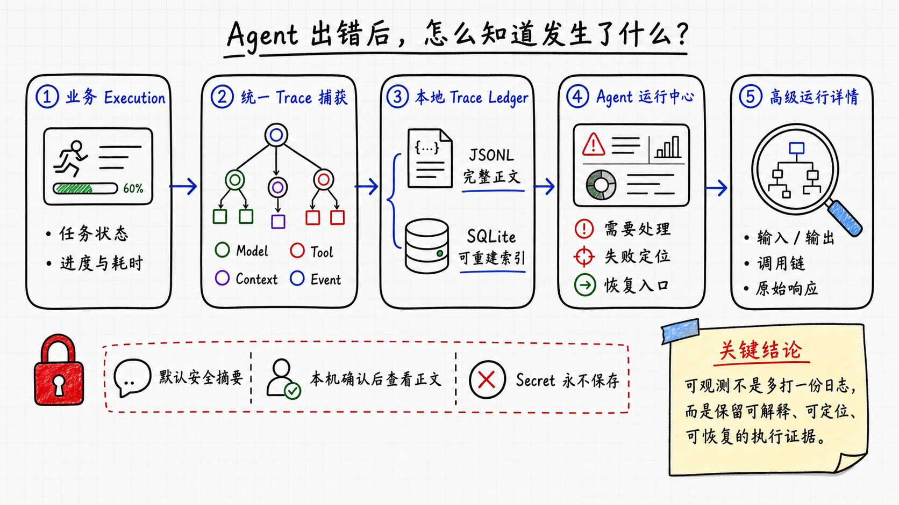
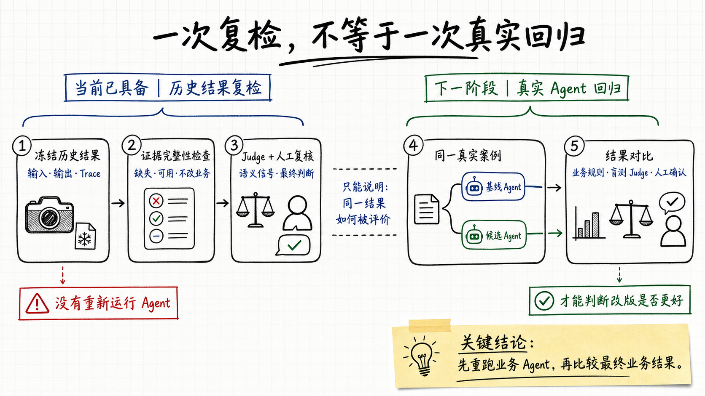

<div align="center">

# Cyber Interview Agent

### A local-first, evidence-driven multi-agent system for interview preparation

把零散资料、个人经历、目标岗位和训练反馈，持续转化为可追溯、可确认、可恢复、可诊断、可评估的个人面试准备闭环。

`Python 3.12+` · `FastAPI` · `LangGraph` · `React 19` · `SQLite` · `SSE`

</div>

## 它解决什么问题

真正的面试准备通常散落在简历、项目文档、随手笔记、JD、聊天记录和一次次失败的回答里。通用对话工具可以帮你处理其中某个任务，但很少替你长期维护“哪些事实可信、哪些建议待确认、某个岗位还差什么、上次练到哪里、失败后怎样继续”。

Cyber Interview Agent 为此建立一组职责明确的领域 Agent：

- 题目整理与复习 Agent，把不规范笔记整理成候选题，经确认后进入题库，并根据练习结果持续更新掌握度；
- 个人画像 Agent，从简历和补充资料中形成工作经历、项目、技能与职业方向，同时保留来源和版本；
- 岗位与项目深挖 Agent，分析 JD、映射个人经历、识别差距，并把重点项目练成经得起追问的叙事和项目题；
- 规划中的复盘、模拟面试和 Research Agent，将继续消费同一套可信资产，而不是每次从一段临时 Prompt 重新认识你。

这些领域 Agent 共享同一套运行与质量底座：任务可以暂停、恢复和重试；运行过程可以从业务任务追到实际模型交互；历史结果可以按版本化标准重新质检。让候选版本 Agent 在同一批真实案例上重新运行并比较，是下一阶段正在设计的真实回归能力。



## 为什么不只是“再做一个通用 Agent”

[Codex](https://developers.openai.com/codex/use-cases) 和 [Claude Code](https://code.claude.com/docs/en/sub-agents) 已经能够完成广泛的编码、研究、自动化和多 Agent 任务；Codex 也支持插件与长期工作流，Claude Code 具备记忆、子 Agent 与文件检查点能力。这里的差异不是“谁更智能”，而是产品责任不同：

**Codex、Claude 是面向广泛任务的通用 Agent 工作环境；Cyber Interview Agent 把面试准备本身做成具有长期档案、明确流程和专属界面的领域产品。**

通用 Agent 可以帮助完成一项面试准备任务；本项目负责持续管理整套面试准备系统：个人事实如何进入画像、模型建议何时生效、岗位差距如何追踪、一次训练如何回流、一次失败执行如何恢复，都有稳定的产品语义。

## 真实产品界面

以下画面由 [`README Demo`](examples/readme-demo/) 虚构数据通过项目真实领域服务生成，不是静态 UI 稿，也不包含个人资料。

<table>
  <tr>
    <td width="50%"></td>
    <td width="50%"></td>
  </tr>
  <tr>
    <td><strong>资料 → 候选题 → 人工确认</strong><br>完整保留来源、候选状态、Agent 会话和发布入口。</td>
    <td><strong>简历 → 结构化画像 → 岗位上下文</strong><br>经历、项目、技能与职业方向成为可复用的长期资产。</td>
  </tr>
</table>



<p align="center"><strong>项目深挖 Agent：</strong>对话、当前阶段、参考范围、草稿、耗时与控制动作处于同一工作台。</p>

## 什么让它成为一个 Agent 项目

这里的 Agent 不等同于“调用一次大模型并展示文字”。系统包含完整的 Agentic Application 运行边界：

1. **目标与状态**：领域 Graph 管理多步骤任务、等待输入、暂停、终止和恢复。
2. **上下文与记忆**：`ContextAssembler` 按用途、资源范围和预算装配资料；长会话支持摘要压缩，领域正文留在 repository，以稳定引用按需读取。
3. **工具与权限**：已知输入的任务不增加无意义的工具循环；只有探索任务获得最小只读 Tool，并由 workspace、scope、次数和 token 预算约束。
4. **可恢复执行**：`Session / Message / Execution / Event` 分离。模型失败或用户停止后，重试创建新的 Execution，而不是复制一条用户消息污染上下文。
5. **人机协作**：模型输出 proposal；正式画像、题目和知识发布必须经过证据校验、版本检查、HITL 确认和幂等回执。
6. **多模型运行时**：OpenAI、Anthropic 等 Provider 通过统一 binding 接入，角色可以独立选择模型与推理强度。
7. **可观测与质量评估**：统一运行中心聚合任务状态和异常；高级 Trace 保留真实模型交互；版本化 Eval Pack、Judge 与人工反馈用于复检历史业务结果，同时明确区分“重新质检”与“重新运行 Agent”。



这是一种 **Hybrid Agentic Application**：确定性路径由代码和领域 Graph 控制，模型负责语义理解、评估、追问和生成。它并不追求把每个功能都改成自由 ReAct。Anthropic 的 [Building Effective Agents](https://www.anthropic.com/engineering/building-effective-agents)、OpenAI Agents SDK 的 [Agent orchestration](https://openai.github.io/openai-agents-python/multi_agent/) 与 LangGraph 的 [Workflows and agents](https://docs.langchain.com/oss/python/langgraph/workflows-agents) 都强调根据可预测性和任务开放程度选择工作流或 Agent；本项目把这一原则落实到了写权限、恢复和长期资产边界。

## Agent Runtime：让长任务真的可以继续

题目整理、简历解析和岗位分析不适合被当作一次性的 HTTP 请求。系统把用户语义和运行尝试分开持久化，并用 SQLite checkpoint、领域工作单元与 SSE 事件流支持：

- 处理中实时进度、耗时、token 与上下文状态；
- 暂停、终止、失败重试和进程重启后恢复；
- 已完成工作单元跳过，写入通过版本与幂等回执防止重复；
- 失败消息可重试、替换或放弃，只有有效语义进入后续上下文；
- 大材料不直接塞进 Agent state，原文与证据按领域版本留存。
- 所有业务 Execution 汇总到运行中心；同一会话已被后续运行恢复的旧失败保留为历史证据，但不再误报为当前待处理。



## 从“能运行”到“能解释、能评估”

Agent 的结果具有概率性，仅看到最终回答很难判断：它实际拿到了什么上下文、在哪一步失败、重试是否恢复，以及一次 Prompt 或模型调整是否真的更好。项目因此在业务 Agent 之上增加了两层工程能力：

- **Agent 运行中心**回答“现在发生了什么”：只聚合有业务意义的 Execution，展示阶段、进度、耗时、token、上下文和待处理状态，并能返回对应的整理、复习或训练会话。
- **高级运行详情**回答“为什么会这样”：以 `Execution → Operation → Event` 还原实际控制流；默认只显示安全摘要，本机主动开启高级诊断后才允许查看 Prompt、messages、上下文、工具输入和 Provider 响应。系统只展示服务商真实返回的 reasoning，不猜测模型思维。
- **本地 Trace Ledger**保留诊断事实：JSONL 是完整 Trace 正文，SQLite 只是可重建的检索索引；题目、画像和岗位等业务事实仍由各自领域库负责，诊断数据不会成为第二套业务真相。



定位一次问题还不等于证明一次改版有效。当前质量实验室会冻结真实 Execution，对同一份历史业务结果执行版本化 Eval Pack、Judge 和人工复核；它适合发现评估标准变化与可疑结果，但不会重新运行原业务 Agent，所以不能单独证明 Prompt、模型或 Tool 改版更好。下一阶段会把真实案例放进隔离环境，分别运行基线与候选 Agent，再比较最终业务结果。无论哪一种评估，Judge 失败都不会影响原任务，也没有权限改写业务事实。



## 产品路线

项目能力围绕可信资产、岗位训练和面试反馈逐步扩展：

| 状态 | 能力 | 作用与产出 |
|---|---|---|
| **已具备** | Agent Runtime 与可信知识基础 | 工作区隔离、知识 Vault、版本、HITL、checkpoint、事件流和上下文装配，为所有领域 Agent 提供共同底座。 |
| **已具备** | 题目整理与复习 | 从杂乱材料生成候选题，人工确认后发布；支持轮次练习、追问、评价、掌握度和深入讨论。 |
| **已具备** | 可信个人画像 | 上传 Markdown、PDF、DOCX 简历，生成待确认画像；管理经历、项目、技能、来源、版本和画像助手会话。 |
| **已具备** | 求职目标与项目训练 | 解析 JD、确认岗位要求、映射画像、选择重点项目、项目深挖并沉淀岗位专属项目题。 |
| **已具备** | Agent 运行与初版质检 | 汇总跨领域运行、定位真实模型交互；冻结历史结果，执行证据完整性检查、Judge、人工反馈与历史结果复检。 |
| **设计中** | Evaluation v2 与真实回归 | 以最终业务结果为评估对象；让基线与候选 Agent 在隔离环境重跑同一批真实案例，再用业务规则、盲测 Judge 和人工判断比较。 |
| **规划中** | 面试复盘 Agent | 导入笔记或转录，提取问题、回答和追问，评估表现，并生成待确认的题库、项目叙事和画像变更。 |
| **规划中** | 模拟面试 Agent | 支持技术、项目与 HR 场景；按预算自适应追问，分离面试官与评估者角色，产出可复用报告。 |
| **规划中** | 受控面试情报 Research Agent | 用户明确授权后执行 `Plan → Search → Read → Cross-check → Synthesize`；保留来源 URL、时间与置信度，只生成待确认情报，不直接污染题库和画像。 |
| **规划中** | 本地产品化与外部入口 | 语义检索、关系视图、Obsidian 冲突同步、导出备份，以及微信/飞书中的碎片输入与审核。 |

## 快速开始

需要 Python 3.12.4+、[uv](https://docs.astral.sh/uv/) 和 Node.js / pnpm。

```bash
git clone https://github.com/Miracle778/cyber-interview-agent.git
cd cyber-interview-agent

# Terminal 1
cd backend
uv sync
uv run fastapi dev app/main.py

# Terminal 2
cd frontend
pnpm install
pnpm dev
```

打开 `http://127.0.0.1:5173`，先在「设置」中创建工作区、配置 Provider 和模型绑定，再导入第一份资料。

### Windows PowerShell

Windows 使用 PowerShell 时，主工作区和功能开发工作区必须使用不同端口与应用数据目录，避免串库：

```powershell
# 主工作区：8000 / 5173，默认应用数据
.\scripts\dev-main.ps1

# 功能开发工作区：8001 / 5174，独立应用数据
.\scripts\dev-feature.ps1
```

两个脚本只打印对应环境的两条启动命令，不会自动启动服务。先执行脚本，再分别把输出中的后端、前端命令粘贴到两个 PowerShell 窗口。首次安装依赖时，在 `backend` 运行 `uv sync`，在 `frontend` 运行 `pnpm install`。

<details>
<summary><strong>生成与查看 README Demo</strong></summary>

演示人物、公司、项目、指标与 JD 全部为虚构内容。脚本仅允许重置带有专用 marker 的 Demo 目录。

```bash
cd backend
uv run python ../scripts/seed_readme_demo.py \
  --workspace-root /private/tmp/cyber-interview-agent-readme-demo \
  --app-data-dir /private/tmp/cyber-interview-agent-readme-app \
  --reset --register

CYBER_INTERVIEW_AGENT_DATA_DIR=/private/tmp/cyber-interview-agent-readme-app \
  uv run fastapi dev app/main.py
```

另开终端运行 `pnpm --dir frontend dev`。种子脚本默认使用确定性 fallback，不需要真实模型，也不会接触你的常用 workspace。

</details>

## 技术栈与数据边界

- **Backend**：FastAPI、Pydantic、LangGraph、LangChain、SQLite / aiosqlite、OpenTelemetry。
- **Frontend**：React 19、TypeScript、Vite、TanStack Query。
- **Storage**：本地 workspace、Markdown Vault、运行库与 checkpoint；长期领域事实不以聊天记录作为唯一来源。
- **Security**：API Key 不进入前端持久化、Vault 或业务日志；模型只接收当前任务所需的有界上下文。

“本地优先”不等于“离线推理”：文件、索引、状态和 checkpoint 默认保存在本机；当使用外部模型 Provider 时，经过范围裁剪的上下文仍会发送给相应服务商。

当前适用范围是：**单用户、本地优先、SQLite、单进程可恢复执行**。它不是分布式 Agent 平台、招聘信息聚合器或自动投递系统。Trace 正文不提供远程浏览入口，保留清理由用户显式触发；质量 Judge 只是历史结果的复核信号之一，当前“回归”不会重新运行候选业务 Agent，也不计算模型金额成本。

### Agent Trace 诊断维护

Trace 正文是本地私有诊断数据，元数据索引可以从 JSONL 重建。维护命令必须传入明确的 Workspace 根目录；脚本拒绝 `/`、用户主目录和不含应用数据目录的宽泛目标。

```bash
# 只读检查；存在缺文件、损坏行或失效偏移时返回非零
python3 scripts/check_agent_trace_consistency.py \
  --workspace-root /absolute/path/to/workspace

# 仅重建 Agent Trace 索引表，不改业务表、Trace JSONL 或领域产物
python3 scripts/rebuild_agent_trace_index.py \
  --workspace-root /absolute/path/to/workspace \
  --workspace-id <workspace-id>
```

已按保留策略删除的正文不会由索引重建恢复；需要从备份恢复原 JSONL 后再重建。检查命令默认不执行修复。

## 架构文档

- [产品总体路线](docs/superpowers/specs/2026-07-10-product-development-roadmap-design.md)
- [Agent Runtime 框架收敛](docs/superpowers/specs/2026-07-13-agent-runtime-framework-convergence-design.md)
- [领域 Agent 的 Tool 与写入边界](docs/superpowers/architecture-decisions/2026-07-20-domain-agent-tool-and-write-boundaries.md)
- [全路线 Agent 能力分配](docs/superpowers/architecture-decisions/2026-07-20-agent-capability-allocation-across-roadmap.md)
- [统一可取消执行 Runtime](docs/superpowers/architecture-decisions/2026-07-16-unified-cancellable-execution-runtime.md)
- [可恢复 Agent 任务边界](docs/superpowers/architecture-decisions/2026-07-22-resumable-agent-task-boundary.md)
- [统一个人画像与来源模型](docs/superpowers/architecture-decisions/2026-07-24-unified-profile-and-source-model.md)
- [岗位目标与项目训练边界](docs/superpowers/architecture-decisions/2026-07-25-job-target-project-training-runtime-boundaries.md)
- [Agent 可观测与质量工作台](docs/superpowers/specs/2026-07-29-agent-observability-and-quality-workbench-design.md)
- [Trace Ledger 与质量评估边界](docs/superpowers/architecture-decisions/2026-07-29-agent-trace-ledger-and-evaluation-boundaries.md)
- [Agent 质量评估 v2 设计](docs/superpowers/specs/2026-07-31-agent-evaluation-v2-design.md)
- [业务结果与真实回归边界](docs/superpowers/architecture-decisions/2026-07-31-agent-evaluation-outcome-and-regression-boundaries.md)

项目持续围绕五项原则演进：模型判断可解释、关键变更可确认、长任务可恢复、异常过程可诊断、改版效果可评估，并让每次准备和训练最终沉淀为真正属于用户的面试能力。
