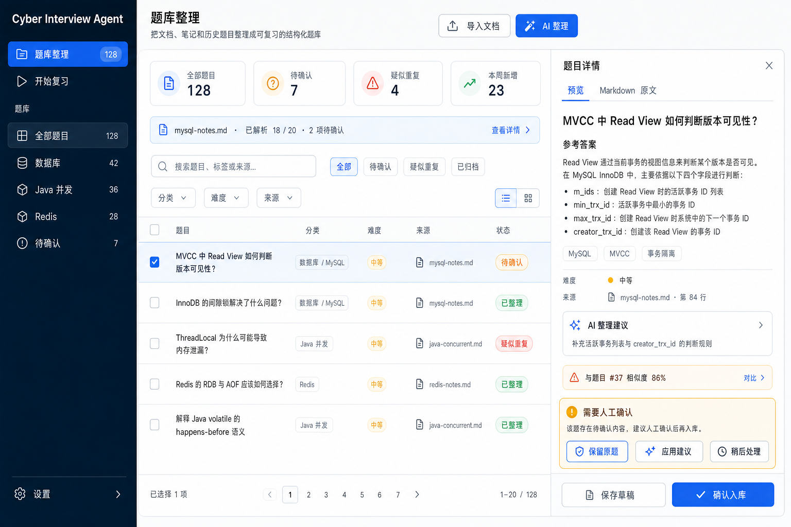
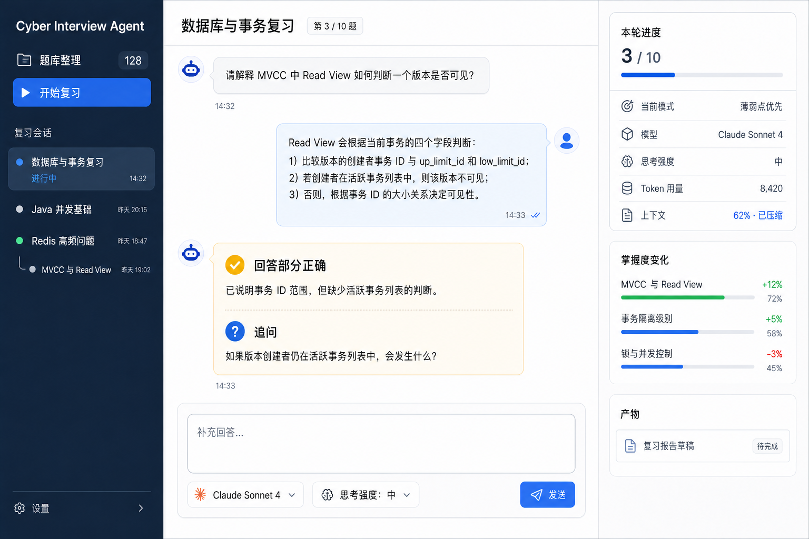

# R2 完整复习 Agent 设计

## 1. 背景与目标

R1 已完成 Provider、Workspace、标准工具、LangGraph checkpoint、持久化 HITL、知识草稿/发布和单题复习闭环；Pre-R2 Agent Runtime Framework Convergence 已把 Agent loop 收敛到 LangChain `create_agent`、官方 `AgentMiddleware`、标准 `BaseTool` 与 LangGraph 原生 stream/interrupt/checkpoint。

R2 不再建设 Runtime 基础设施。目标是利用现有 Agent Harness 实现可长期使用的完整复习流程：从多来源题目整理、题库审核，到可恢复的多题轮次、必要追问、轮次报告和全局掌握度更新。

成功标准：

- 用户可以从已审核题库创建 10-50 题复习轮次；
- 一轮只维护一个可恢复 execution，后端重启后继续当前题而不是重开轮次；
- 选题、进度、快照、掌握度证据和报告状态由显式领域结构拥有，不隐藏在模型消息中；
- 模型评价、追问、题目整理和报告继续通过 role-specific `create_agent`；
- token/context、summary、title、调用上限、no-progress 和 observability 复用官方 middleware stack；
- 派生深入讨论使用独立 session/thread，不污染主轮次；
- 报告和掌握度更新未经用户确认不进入 Vault active scope。

## 2. 范围

### 2.1 本阶段包含

- 从一份或多份 source 生成多个结构化题目候选；
- 接受、编辑、拒绝和要求重写题目草稿；
- 按 topic、难度、模式和题量创建复习轮次；
- 支持薄弱点优先、随机混合、单主题和最近错误复现；
- 每题回答评价、必要追问、跳过和继续；
- 轮次离开后继续、取消和后端重启恢复；
- 轮次结束生成 session report 和 mastery update 草稿；
- 用户审核后发布报告，并更新可追溯的掌握度投影；
- 从某道题派生独立深入讨论 session；
- Web 页面在桌面和窄屏下展示轮次进度、用量、context、产物与恢复提示；这只是
  响应式 Web 质量，不代表微信、飞书等原生 Channel 已接入。

### 2.2 不包含

- 间隔重复日历、通知和自动学习计划；
- 正式 Todo Service、行动项持久化或自动创建任务；
- 个人简历、岗位/JD、面试复盘或模拟面试能力；
- 多 Agent supervisor 或任意动态 Agent 委派；
- 自动发布题目、报告或掌握度文档；
- 新的 Agent Runtime、middleware pipeline、模型 Gateway、Tool Registry 或 Graph Registry；
- 本文不拆 implementation tasks，实施计划在用户确认本设计后另写。

## 3. 核心架构决策

### 3.1 采用一个长生命周期轮次 Graph

一个复习轮次对应：

- 一个产品 `review.round` session；
- 一个活动 execution；
- 一个外层 LangGraph thread；
- 多个按 role 派生的 Agent thread。

Graph 在展示题目后通过 input interrupt 暂停。应用层把 interrupt 投影为 `input.required` 产品事件和 `waiting_for_input` execution 状态；用户回答通过带 request ID 和 idempotency key 的输入资源恢复同一 checkpoint。必要追问再次产生 input interrupt。轮次结束或取消后 execution 才进入终态。

`waiting_for_input` 本身就是可持久恢复的暂停状态：用户离开页面不改变轮次，重新进入后继续当前 input request。R2 不再增加一套独立 pause 状态机。

这与审批 action 不同：回答题目是领域输入，不创建 pending action；报告发布仍使用现有 action/HITL 流程。

### 3.2 不采用的方案

1. **每道题创建一个新 execution**：实现简单，但轮次状态分散到产品表和多个 checkpoint，重启、预算、context 与无进展判断难以形成真实长会话；不采用。
2. **让单个 Agent 自主决定整轮选题和进度**：模型可以灵活对话，但题量、顺序、去重、完成条件和证据会隐藏在消息中，无法可靠恢复和审计；不采用。
3. **推荐方案：领域 Graph + role Agent 节点**：确定性节点拥有题目快照、顺序、进度和合并，Agent 节点只执行适合模型的评价、追问和生成；采用。

### 3.3 与现有 `review.single` 的关系

`review.single` 保留为单题快速入口和回归场景。R2 新增 `review.round` 与 `review.discussion`，复用现有 evaluator/reporter 契约与 middleware。不得把 `review.single` 扩成包含大量条件分支的万能 Graph。

## 4. 用户流程

### 4.1 题库准备

1. 用户上传一份或多份 source；
2. `question_generation` Agent 基于选定 source 生成题目候选批次；
3. 每个候选保存为 `question` knowledge draft，保留 source refs、生成批次和内容 hash；
4. 用户可以接受并发布、编辑后发布、拒绝或要求重写；
5. 只有已发布题目进入 active question catalog 和复习选择范围。

重写创建新 draft version，不覆盖已发布题目；多来源产生的相似题目先标记候选重复，由用户确认是否合并。

### 4.2 创建轮次

用户选择：

- topics；
- difficulty 范围；
- mode：`weak-point`、`random-mixed`、`topic-focused`、`recent-mistake`；
- question count，范围 1-50；
- 是否允许必要追问；
- 本轮交互评价使用的已配置模型，以及该模型声明支持的思考强度。

模型选择值是 Workspace 中已启用 `provider_model_id` 的服务端引用，不是允许前端传入任意 Provider/model 字符串。思考强度使用统一枚举并由 Provider adapter 映射；模型不支持时 UI 不提供该选项，API 收到不支持组合返回 422。轮次创建时冻结 `answer_evaluation` 的模型与思考强度，后续调用和审计均使用该快照；题目生成、报告和派生讨论仍分别使用自己的 role binding，除非对应命令也显式提供经过验证的 session override。

确定性 selector 从 active catalog 和已确认 mastery projection 中选题。轮次启动时冻结题目 ID、内容版本/hash、顺序和 mastery before，避免轮次中题库外部编辑改变当前问题。

### 4.3 回答循环

每题按以下路径运行：

```text
load frozen question
  -> request answer input
  -> evaluate answer Agent
  -> deterministic follow-up policy
       -> no follow-up -> persist attempt
       -> follow-up required -> request follow-up input -> evaluate supplement
  -> calculate mastery suggestion
  -> advance progress
       -> more questions -> next question
       -> round complete -> generate reports
```

模型失败时不推进 current index；用户可以重试、跳过或取消。重复提交同一 input request 返回同一结果，不重复评价或推进。

### 4.4 报告与掌握度

轮次完成后：

1. `report_summarization` Agent 根据结构化 attempts 生成 session report；
2. 确定性聚合器生成 mastery change proposal，报告 Agent 负责解释，不直接改写 mastery；
3. session report 和 mastery report 分别创建 knowledge draft；
4. 用户可以接受、编辑、拒绝或要求重写；
5. 发布完成后更新 active mastery projection，并记录 report/draft/publication evidence refs；
6. 同一轮次重复生成报告使用 round ID + report kind 幂等，新版本发生内容冲突时交给用户选择。

新轮次选择题目时只参考已确认的全局 mastery projection 与最近三份已发布 session report；未确认草稿不参与选择。

### 4.5 派生深入讨论

用户可从当前题或 attempt 创建 `review.discussion` 子 session。子 session 保存 `parent_session_id`、question snapshot 和 attempt evidence refs，使用 `agent_chat` role 与独立 thread。讨论结果默认只存在于子 session；用户主动生成草稿并确认后才进入知识库或影响 mastery。

## 5. Agent 与 Graph 设计

### 5.1 Agent roles

| Role | 用途 | 输入 | 输出 | 工具 |
|---|---|---|---|---|
| `question_generation` | 多来源题目候选与重写 | source excerpts、现有相似题摘要、用户重写意见 | `QuestionCandidateBatch` | 只读 source/active knowledge |
| `answer_evaluation` | 当前题回答与追问补充评价 | frozen question、answer、可选 supplement | `RoundAnswerEvaluation` | 默认无工具 |
| `report_summarization` | session report 与 mastery 解释 | 结构化 attempts、round settings、confirmed prior reports | Markdown/结构化报告 | 只读确认报告 |
| `agent_chat` | 派生深入讨论 | question snapshot、attempt evidence、对话消息 | 对话消息 | 受限只读知识工具 |

沿用现有四个模型用途绑定，不在 R2 增加设置页 role。所有结构化输出通过 `AgentFactory` 与官方 `ToolStrategy`；Provider secret 不进入 prompt、Graph state 或 checkpoint context。

### 5.2 Graph kinds

- `question.curate`：生成或重写 question drafts；候选审核通过现有知识草稿 UI 和 publication action，不在 Agent 内自动发布；
- `review.round`：持有选题、回答、追问、attempt、进度和报告生成的显式领域 Graph；
- `review.discussion`：独立对话 Graph，只引用主轮次 snapshot，不写主轮次 state；
- `review.single`：保留现状，不承载多题轮次状态。

`ProductionGraphFactory` 继续显式选择支持的 kind；这不是恢复动态 Graph Registry。

### 5.3 `ReviewRoundState`

`ReviewRoundState` 定义在 `app/graphs/review_round.py`，不与 Agent 结构化输出混放。Graph state 至少包含：

```text
round_id
settings
question_snapshots[]
current_index
current_input_request
current_answer
current_evaluation
current_follow_up
attempt_ids[]
report_draft_ids[]
status
```

state 只保存恢复所需的紧凑结构和稳定引用。完整 source、Vault Markdown、Provider 配置、secret、产品事件列表和所有历史报告不复制进 checkpoint。

### 5.4 确定性领域节点

以下能力不得交给模型自由决定：

- 候选题过滤与固定 seed 下的可复现排序；
- 题量、去重、current index 和轮次完成条件；
- question snapshot/version/hash 冻结；
- input request ID、幂等和重复回答处理；
- follow-up 最大次数；
- attempt 持久化与 mastery 变化计算；
- draft/version/hash、publication receipt 和 active scope；
- 报告合并冲突与用户决定。

## 6. 工具与安全边界

R2 只使用标准 `BaseTool`/`StructuredTool` 和 `ToolRuntime[AgentContext]`。候选工具：

- `read_source`：读取当前 Workspace 内明确引用的 source；
- `read_active_knowledge`：读取已发布知识；
- `read_confirmed_review_reports`：读取最多三份确认报告；
- `search_question_catalog`：按安全筛选条件查询 active question projection。

工具业务 schema 不包含 workspace/session/execution/scope；这些身份由服务端 `AgentContext` 注入。`ToolPolicyMiddleware` 在 handler 前检查 allowlist/scope/audit，handler 内再次执行 Workspace path policy。

题目草稿、attempt、round、报告、mastery 和 publication 写入由领域 service/Graph 节点执行，不暴露为允许模型任意调用的通用写工具。

## 7. Middleware 组合

每个 role Agent 继续通过 `build_default_middleware` 组合官方与窄项目 middleware：

- `ProjectingSummarizationMiddleware` / 官方 summary；
- `ContextEditingMiddleware`；
- `ModelCallLimitMiddleware`；
- `ToolCallLimitMiddleware`；
- `ToolPolicyMiddleware`；
- 必要时的 `HumanInTheLoopMiddleware`；
- usage、title、no-progress 和 observability 项目 middleware。

R2 允许按 role/round 配置预算 profile，但不创建新的 pipeline 或 middleware 协议。默认限制必须按 10-50 题场景重新校准：

- run limit 保护单次 answer/evaluation 调用；
- thread limit 保护整轮和 role 历史；
- round 还拥有题数、追问次数、总 token 和总耗时硬预算；
- no-progress 指纹必须包含 round ID、current index 和 input request ID，避免不同题目的相似 prompt 被误判为循环；
- summary 发生在 role thread 内，产品 session 只投影 `contextCompacted`；
- exporter、标题和辅助投影 fail-open，路径/权限/预算/no-progress fail-closed。

回答题目使用 Graph input interrupt，不配置成工具审批。只有真实危险工具才进入 `HumanInTheLoopMiddleware`。

## 8. Thread、checkpoint 与恢复

稳定映射：

```text
product session: <session_id>
outer round thread: <session_id>
question generation Agent: <session_id>:question_generation
answer evaluator Agent: <session_id>:answer_evaluation
report Agent: <session_id>:report_summarization
discussion session/thread: <discussion_session_id>
discussion Agent: <discussion_session_id>:agent_chat
```

不同 role 不共享 message history。外层 Graph checkpoint 保存 current question/input interrupt；role thread 保存该角色的必要消息与 summary。后端重启时运行中的 execution 转为 interrupted，等待输入或审批的 checkpoint 保留；恢复必须使用原 execution 和 thread，不能创建隐式新轮次。

## 9. 状态所有权与数据模型

| 状态 | 唯一事实 |
|---|---|
| Graph current node、input interrupt、Agent messages、summary | LangGraph checkpoint |
| session/execution/message/action/usage/product events | 产品 Runtime SQLite 投影 |
| round settings、frozen order、progress、status | Review round domain record |
| 每题 answer/evaluation/follow-up/mastery suggestion | Review attempt domain record |
| 未确认 question/report/mastery 内容 | Knowledge draft + draft file |
| 已发布 question/report/mastery Markdown | Vault |
| 可选择题目 metadata | 从已发布 question 重建的 question catalog projection |
| 当前 mastery 查询 | 从已确认 mastery report/evidence 重建的 mastery projection |
| 页面请求状态 | TanStack Query/local form state，不是持久化事实 |
| trace | OpenTelemetry/Langfuse，不是业务真相源 |

建议新增领域资源：

- `review_rounds`：settings、frozen question refs/order、current index、status、active execution；
- `review_attempts`：ordinal、question snapshot ref、answer、follow-up、evaluation、mastery suggestion、timestamps；
- `review_input_requests`：request ID、kind、status、version、idempotency key；
- `question_catalog`：已发布题目的可重建选择投影；
- `mastery_projection`：confirmed report 驱动的可重建 topic/question 状态与 evidence refs。

R2 使用 additive migration，不再次清空刚收敛的 Runtime generation。数据库内部遗留列名不是前端 API 契约；新 API 继续使用 session/execution 命名。

## 10. 应用服务与 API

新增窄领域服务：

- `QuestionCurationService`：候选批次、重写请求和 draft 关联；
- `ReviewRoundService`：创建/查询轮次、冻结选题、提交输入、跳过、取消；
- `ReviewAttemptRepository`：attempt 与 input request 幂等；
- `MasteryProjectionService`：确认报告后的 evidence-based projection 更新和重建。

建议产品 API：

```text
POST /api/review/question-batches
GET  /api/review/question-batches
GET  /api/review/question-batches/{id}
GET  /api/review/question-candidates
GET  /api/review/question-candidates/{id}
PATCH /api/review/question-candidates/{id}
POST /api/review/question-candidates/{id}/rewrite
GET  /api/review/questions

POST /api/review/rounds
GET  /api/review/rounds
GET  /api/review/rounds/{id}
POST /api/review/rounds/{id}/answers
POST /api/review/rounds/{id}/skip
POST /api/review/rounds/{id}/cancel
POST /api/review/rounds/{id}/discussions
```

`question-candidates` 是整理工作台资源，支持 `query`、`topic`、`difficulty`、`sourceId`、`status`、分页和排序；资源包含安全的 source ref、draft/publication state、duplicate summary 和 pending decision ID。`questions` 只返回已发布 active catalog，供轮次设置与 selector 使用，不能用未确认 candidate 伪装 active question。`question-batches` 列表/详情返回真实解析计数和状态，供进度条在刷新后恢复。

`answers` 请求必须包含 `inputRequestId`、`version` 和 `idempotencyKey`。领域 API 在内部调用现有 Agent session/execution/application service；不复制 checkpoint/resume 实现。Action 审批继续使用 `/api/agent/actions/...`。

产品事件至少包括：

- `review.round.started`；
- `review.input.required` / `review.input.resolved`；
- `review.attempt.completed`；
- `review.progress.changed`；
- `review.report.draft_created`；
- `review.round.completed` / `failed` / `cancelled`；
- 通用 usage、warning、action 和 publication 事件。

事件 payload 只含安全 ID、ordinal、count、状态和可展示摘要，不包含 reference answer、完整 source、Provider 异常或 secret。

## 11. 前端信息架构

R2 使用统一的复习工作台 Shell，而不是把题库、单题表单、运行状态和人工确认平铺在同一页面。一级导航先区分上游的“题库整理”和下游的“开始复习”，页面内部再按当前资源和状态渐进披露操作。

### 11.1 设计原则与还原优先级

- **任务链清晰**：题库整理负责“导入 -> 解析 -> 去重 -> 结构化 -> 确认入库”，开始复习负责“选题 -> 回答 -> 评价/追问 -> 报告”；两者是独立一级入口，但共享题库和 session 事实。
- **主任务优先**：当前问题、回答输入和题目内容始终占据最大区域；历史、usage、context 和产物作为辅助信息放在侧栏或窄屏折叠区。
- **按需确认**：普通答题、浏览题目和已确定状态不显示 HITL。只有当前资源确实存在 pending action、重复冲突或 AI 整理不确定项时，才在资源上下文内展示确认卡片。
- **默认渲染 Markdown**：题目、参考答案、报告等阅读态默认展示渲染结果；只有用户主动进入编辑或选择“Markdown 原文”标签时展示源码。
- **服务端事实驱动**：计数、筛选结果、进度、状态、草稿、usage 和 publication 均来自 API/Query；效果图中的数字只用于说明布局，不能写死。
- **保留现有视觉系统**：使用项目现有 token、组件和可访问性规则还原信息层级，不为逐像素复制效果图引入新的 UI 框架。

还原优先级如下：

1. 必须还原：一级导航、页面区域职责、状态显隐、主要操作顺序、Markdown 阅读/编辑边界、桌面与窄屏信息优先级。
2. 尽量还原：三栏比例、卡片密度、列表层级、颜色语义、图标与间距。
3. 允许调整：具体像素、示例文案、图标形状和统计数字；调整不得改变任务链或把服务端事实退化为前端本地状态。

### 11.2 应用 Shell 与一级导航

桌面端左侧使用稳定应用导航：

```text
Cyber Interview Agent
├─ 题库整理       count
├─ 开始复习
├─ 当前模块的集合/会话列表
└─ 设置
```

- `题库整理` 是独立一级入口，展示 active catalog 总量或待处理提示；不能藏在知识库上传页或复习历史中。
- `开始复习` 进入轮次工作台。未开始时显示轮次设置；进行中时显示当前会话与派生讨论列表。
- 一级入口下方的二级列表随模块变化：题库模块展示分类与待确认数量，复习模块展示轮次历史和派生讨论。
- 选中态只表达当前位置，不改变资源状态；“进行中”“待确认”等状态使用独立 badge/dot。

### 11.3 题库整理工作台

题库整理桌面端采用“应用导航 + 题目列表 + 详情面板”三段布局：

1. **左侧导航**：一级入口、全部题目、topic 分类、待确认；数量来自 `GET /api/review/questions` 聚合结果。
2. **中间工作区**：页头提供“导入文档”和“AI 整理”；摘要卡展示全部、待确认、疑似重复和本周新增；随后是解析进度、搜索、状态/topic/难度/来源筛选以及可多选的题目列表。
3. **右侧详情**：展示选中题目的渲染预览、Markdown 原文/编辑入口、参考答案、tags、难度、source ref、AI 建议、重复相似度与保存/确认入库操作。

题库整理状态规则：

- source 上传只建立来源；“AI 整理”明确选择一个或多个 source 后创建 question batch。
- 解析条显示真实批次进度和待确认数量；失败项可针对性重试，不重跑已完成候选。
- 列表至少区分 `待确认`、`疑似重复`、`已整理`、`已归档`，并支持搜索与组合筛选。
- 点击行只切换详情资源，不自动接受建议或发布。
- AI 整理建议属于可编辑草稿；用户可保留原题、应用建议或稍后处理。
- “需要人工确认”只在候选不确定、重复冲突或版本冲突时出现，并与当前选中题绑定；没有 pending decision 时整个确认卡不渲染。
- “确认入库”走现有 draft/publication action，成功后刷新 catalog、统计和详情 publication state；不能仅修改前端 badge。

桌面参考图：



### 11.4 复习轮次工作台

复习轮次桌面端采用“会话导航 + 对话式答题 + 运行状态”三栏布局：

- **左栏**：`题库整理`、`开始复习` 一级入口，下方展示复习会话；派生 discussion 作为父会话的缩进子项，不与主轮次混为同一 thread。
- **中栏**：顶部显示轮次标题和 `ordinal / total`；正文以消息流展示题目、用户回答、结构化评价和必要追问；底部固定回答输入区。
- **右栏**：展示本轮进度、选题模式、当前模型、思考强度、token/context、掌握度变化和报告草稿等运行事实。
- 模型与思考强度在创建轮次时冻结为 session 配置；进行中可展示但默认不静默切换。若产品允许中途修改，必须通过显式命令并记录从下一次模型调用生效。
- 评价卡使用 `poor` / `partial` / `good` 的稳定语义展示证据和缺失点，不展示 hidden reasoning。
- 普通回答和追问使用 input request，不展示 HITL；只有报告发布等真实 pending action 才显示确认区域。
- 输入发送后保留幂等状态；失败时保留用户文本并提供重试，不乐观推进题号。

复习页按轮次状态切换三个主视图：

1. **轮次设置**：topic、difficulty、mode、question count、追问开关和预计范围；
2. **进行中**：当前题、ordinal/total、回答区、必要追问、进度、tokens/context/预算、稍后继续/跳过/取消；“稍后继续”只离开页面并保留 `waiting_for_input`，不调用新 pause API；
3. **轮次结果**：attempt 摘要、薄弱点、session/mastery drafts、审核与发布状态、下一轮建议。

侧边或折叠区域显示历史轮次与派生讨论。人工确认只在存在 pending action 时出现；普通答题 input 不伪装成审批。刷新后页面完全从 round/session/action resources 恢复，不依赖组件内累计数组。

桌面参考图：



### 11.5 响应式与可访问性

窄屏 Web 保持单列，主要回答操作触控区域不小于 44px；375px 无横向溢出。
当前题和输入框优先于历史、usage 详情和报告附件。微信、飞书原生聊天窗口中的
Agent 对话属于 R8，不在 R2 用响应式浏览器页面替代。

- 窄屏顶部先提供当前模块、返回/菜单和关键状态；列表与详情改为路由或抽屉顺序浏览，不能把三栏强行压缩。
- 题库详情抽屉打开后必须有明确返回列表操作，并保留搜索、筛选与滚动位置。
- 复习中优先显示题目、评价/追问和输入；运行状态进入可展开面板，会话历史进入抽屉。
- 焦点顺序、键盘操作、aria label、错误提示和颜色对比遵循现有设计系统；状态不能只依赖颜色表达。

## 12. 一致性、失败与恢复

- **题目外部编辑**：轮次使用 frozen snapshot；编辑只影响下一轮；
- **重复回答**：同 input request + idempotency key 返回已有 attempt；不同 key 在已解决 request 上返回 conflict；
- **模型失败**：current index 不推进，保留 answer，允许重试或跳过；
- **重启**：等待输入/审批从 checkpoint 恢复；运行中转 interrupted 后由用户显式继续；
- **题目不足**：创建轮次前返回实际可用数量和筛选建议，不静默降低题量；
- **报告冲突**：保存新 draft version，用户选择内容，不覆盖已发布报告；
- **mastery 冲突**：以 confirmed report version/evidence refs 做 compare-and-set，冲突生成待审核合并建议；
- **context/预算超限**：先 summary/软警告，硬限额停止当前 execution，保留 round progress 和恢复建议；
- **observability 故障**：记录本地 warning 并继续业务；
- **取消**：取消活动 task、保存 round cancelled，不发布报告，不丢失已完成 attempts。

## 13. 安全与隐私

- source、reference answer、用户回答和报告正文默认不进入 OTel attributes；
- 模型只能读取当前 Graph 明确提供的 question/source/report refs；
- question generation 不读取个人资料、岗位或未来 R3/R4 目录；
- discussion Agent 的工具和 thread 与主轮次隔离；
- 所有写入都经过 Workspace path policy、draft version/hash 和 publication receipt；
- 未确认 question/report/mastery draft 不进入 active knowledge scope，不参与下一轮选择；
- 前端、模型和 Channel 都不能提供可信 workspace/scope，服务端 context 是唯一身份来源。

## 14. 验证与验收

### 14.1 自动验证

- selector 四种模式、固定 seed、题量不足和 snapshot 冻结；
- round Graph 多次 input interrupt/resume、必要追问、skip、cancel 和完成；
- answer idempotency、并发输入 conflict、模型失败不推进；
- checkpoint 重启恢复和 role thread 隔离；
- 10 题长轮次触发 usage/summary/title/no-progress 行为；
- question/report/mastery draft version/hash 与发布幂等；
- discussion child session 不修改父 round checkpoint/messages；
- Workspace path、scope、audit、secret 和事件 payload 安全；
- API resource、SSE cursor、前端 query 刷新和错误恢复。

### 14.2 真实 Provider 验收

- OpenAI-compatible：题目候选或结构化评价至少一条真实调用；
- Anthropic-compatible：追问、报告或 discussion 至少一条真实流式调用；
- 原生 usage 与缺失 usage 的 estimated fallback 都可见；
- 真实长轮次至少触发一次 summary，内容仍能继续恢复；
- 当前 R2 验收环境默认不配置 Langfuse，不启动 Langfuse 容器，也不要求查询 trace；完整复习闭环必须在无 Langfuse 的默认环境中正常完成。

Langfuse 正常导出、可视化内容检查和服务不可达场景不属于当前 R2 交付门禁，后续 observability 专项验收再覆盖。OpenTelemetry/Langfuse 仍是可选观测实现，不得成为业务启动或执行依赖。

### 14.3 浏览器验收

- 左侧一级导航能在“题库整理”和“开始复习”间切换，并分别恢复对应筛选/会话上下文；
- 题库整理覆盖导入、真实批次进度、组合筛选、详情预览、Markdown 原文/编辑、重复对比和确认入库；无待确认项时不渲染人工确认卡；
- 从已发布题库创建至少 10 题轮次并完成；
- 覆盖必要追问、跳过、刷新、后端重启、重复提交和取消；
- 轮次报告/mastery draft 的接受、编辑、拒绝和发布；
- 派生 discussion 后返回主轮次，消息不互相污染；
- 桌面验证三栏职责与主要操作顺序，375px 窄屏 Web 验证列表/详情、会话/状态降级且无溢出；人工确认仅在 pending action 时出现；该证据不计入 R8 Channel 验收；
- Vault target path、报告 evidence 和下一轮 selection 实际引用已确认 mastery。

## 15. 产品成熟度边界

R2 完成后可标记为“完整复习场景可用”，含义是用户能持续完成多题轮次并形成可审核的掌握度证据；不代表已具备间隔重复计划、岗位联动、正式 Todo、模拟面试或微信/飞书原生对话 Channel。

用户 ownership 学习与练习继续独立记录，不阻塞产品实施、提交或下一阶段设计。
