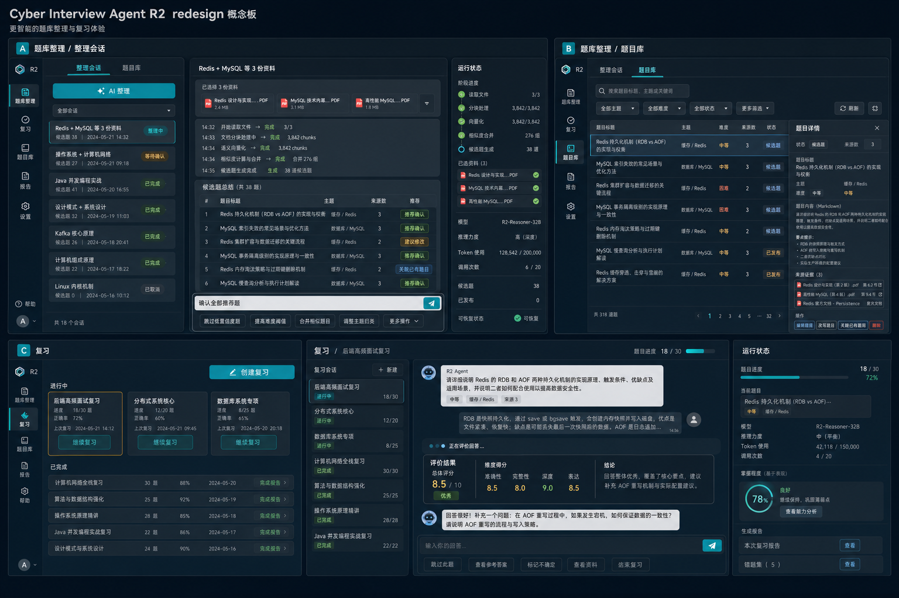

# R2 完整复习 Agent 设计

## 1. 背景与目标

R1 已完成 Provider、Workspace、标准工具、LangGraph checkpoint、持久化 HITL、知识草稿/发布和单题复习闭环；Pre-R2 Agent Runtime Framework Convergence 已把 Agent loop 收敛到 LangChain `create_agent`、官方 `AgentMiddleware`、标准 `BaseTool` 与 LangGraph 原生 stream/interrupt/checkpoint。

R2 不再建设 Runtime 基础设施。目标是利用现有 Agent Harness 实现可长期使用的完整复习流程：从多来源题目整理、题库审核，到可恢复的多题轮次、必要追问、轮次报告和全局掌握度更新。

成功标准：

- 用户可以从已审核题库创建 10-50 题复习轮次；
- 一轮只维护一个可恢复 execution，后端重启后继续当前题而不是重开轮次；
- 选题、进度、快照、掌握度证据和报告状态由显式领域结构拥有，不隐藏在模型消息中；
- 模型评价、追问、题目整理和报告继续通过 role-specific `create_agent`；
- 题库整理和复习均以可恢复会话呈现，用户能看到真实阶段、消息和产物，不把后台批处理伪装成静态列表；
- 回答提交快速返回，Web 通过 SSE 显示可观察阶段和最终结构化结果，不暴露模型内部思维链；
- token/context、summary、title、调用上限、no-progress 和 observability 复用官方 middleware stack；
- 派生深入讨论使用独立 session/thread，不污染主轮次；
- 报告和掌握度更新未经用户确认不进入 Vault active scope。

## 2. 范围

### 2.1 本阶段包含

- 从一份或多份 source 生成多个结构化题目候选；
- 一次选择的 source 集合创建一个独立题库整理会话，允许但不推荐重复选择正在整理或曾整理的来源；
- 在整理会话内查看读取、分片、生成、合并、总结和发布进度，并通过受约束的自然语言命令确认、拒绝或重写候选题；
- 接受、编辑、拒绝和要求重写题目草稿；
- 按 topic、难度、模式和题量创建复习轮次；
- 支持薄弱点优先、随机混合、单主题和最近错误复现；
- 每题回答评价、必要追问、跳过和继续；
- 历史优先的复习首页、显式“创建复习”入口、多个未完成轮次和聊天式异步回答体验；
- 轮次离开后继续、取消和后端重启恢复；
- 轮次结束生成 session report 和 mastery update 草稿；
- 用户审核后发布报告，并更新可追溯的掌握度投影；
- 从某道题派生独立深入讨论 session；
- Web 页面在桌面和窄屏下展示轮次进度、用量、context、产物与恢复提示；这只是
  响应式 Web 质量，不代表微信、飞书等原生 Channel 已接入。

### 2.2 不包含

- 间隔重复日历、通知和自动学习计划；
- 正式 Todo Service、行动项持久化或自动创建任务；
- 个人简历、岗位/JD、面试复盘或模拟面试能力；
- 多 Agent supervisor 或任意动态 Agent 委派；
- 自动发布题目、报告或掌握度文档；
- 新的 Agent Runtime、middleware pipeline、模型 Gateway、Tool Registry 或 Graph Registry；
- 本文不拆 implementation tasks，实施计划在用户确认本设计后另写。

## 3. 核心架构决策

### 3.1 采用一个长生命周期轮次 Graph

一个复习轮次对应：

- 一个产品 `review.round` session；
- 一个活动 execution；
- 一个外层 LangGraph thread；
- 多个按 role 派生的 Agent thread。

Graph 在展示题目后通过 input interrupt 暂停。应用层把 interrupt 投影为 `input.required` 产品事件和 `waiting_for_input` execution 状态；用户回答通过带 request ID 和 idempotency key 的输入资源恢复同一 checkpoint。必要追问再次产生 input interrupt。轮次结束或取消后 execution 才进入终态。

`waiting_for_input` 本身就是可持久恢复的暂停状态：用户离开页面不改变轮次，重新进入后继续当前 input request。R2 不再增加一套独立 pause 状态机。

这与审批 action 不同：回答题目是领域输入，不创建 pending action；报告发布仍使用现有 action/HITL 流程。

### 3.2 不采用的方案

1. **每道题创建一个新 execution**：实现简单，但轮次状态分散到产品表和多个 checkpoint，重启、预算、context 与无进展判断难以形成真实长会话；不采用。
2. **让单个 Agent 自主决定整轮选题和进度**：模型可以灵活对话，但题量、顺序、去重、完成条件和证据会隐藏在消息中，无法可靠恢复和审计；不采用。
3. **推荐方案：领域 Graph + role Agent 节点**：确定性节点拥有题目快照、顺序、进度和合并，Agent 节点只执行适合模型的评价、追问和生成；采用。

### 3.3 与现有 `review.single` 的关系

`review.single` 保留为单题快速入口和回归场景。R2 新增 `review.round` 与 `review.discussion`，复用现有 evaluator/reporter 契约与 middleware。不得把 `review.single` 扩成包含大量条件分支的万能 Graph。

### 3.4 会话投影而不是前端伪聊天

题库整理和复习继续复用现有产品 session、execution、message、event、checkpoint 与 HITL，不创建新的通用 Agent Runtime。领域表仍拥有题目、attempt、轮次和 publication 真相；会话消息是面向 Web 和未来 Channel 的持久投影，允许使用结构化 `message_kind` 与安全 metadata 表达题目、回答、评价、进度、总结和发布结果。

不采用“只在前端把 batch/round 拼成聊天气泡”的方案，因为这种做法无法在刷新、重启和 SSE 断线后恢复真实进度。也不把题库和复习改造成自由聊天 Agent；自然语言只进入显式领域命令，确定性服务继续控制选题、合并边界、幂等、发布和状态推进。

题库整理 session 可以包含多个 execution：首次整理、重写和重新总结都在同一 session 留下消息，但每次执行遵守单 session 仅一个活动 execution 的约束。复习轮次继续使用一个长生命周期 execution。

## 4. 用户流程

### 4.1 题库准备

1. 用户上传 source，在点击“AI 整理”时选择一份或多份文件；
2. UI 对正在整理和曾整理的文件给出非阻断提示，确认后的文件集合创建一个新的 `question.curate` session；
3. 会话按 `reading_sources -> generating -> merging -> summarizing -> waiting_for_command` 显示真实阶段和分片进度；
4. `question_generation` Agent 生成结构化候选，领域服务在本会话内合并高置信度重复题，并把来源取并集；
5. 与 active catalog 的相似题不覆盖原题。会话总结标记“关联已有题目”，用户确认后增加来源关联；
6. Agent 生成逐题摘要，包含 topic、难度、来源数量、重复风险以及“推荐确认/建议修改/建议拒绝”；
7. 用户通过 `确认全部推荐题`、`确认第 1、3 题`、`拒绝第 2 题`、`重写第 4 题：...` 等受约束命令继续；
8. 明确确认消息本身作为可审计 HITL 决定，通过现有 publication service/action receipt 发布，不再要求第二次点击；
9. 只有已发布题目进入 active question catalog 和复习选择范围。

一次点击始终创建新会话，即使选择了完全相同的文件集合。重复来源和多来源关系通过稳定关联记录维护。低置信度相似题只标记、不自动合并；重写创建新 draft version，不覆盖已发布内容。含糊表达不能触发发布，Agent 必须要求用户给出明确选择。

相似题合并采用“召回、判断、归并”三段式边界。领域层先统一 Unicode、大小写、标点和常见问句套话，在 topic 有交集时对题干计算字符序列/二元组相似度；会话内达到高置信阈值的候选自动归为一组，保留第一道主候选并合并全部 source/evidence、关键点和追问。与 active catalog 的中等置信相似只设置关联提示，绝不覆盖已发布题。需要模型判断的模糊分组可由多个只读 merge worker/subagent 并行返回严格结构化 decision，但它们不得直接写数据库；唯一 reducer 校验 decision、合并来源并在一个事务中持久化，冲突或低置信结果交给用户确认。

### 4.2 创建轮次

“开始复习”默认进入历史首页，而不是自动打开最新轮次或直接展示创建表单。进行中轮次置顶并提供“继续复习”；“创建复习”是独立主按钮。允许同时存在多个未完成轮次，新建时只提醒、不取消或阻止既有轮次。

点击“创建复习”后，用户选择：

- topics；
- difficulty 范围；
- mode：`weak-point`、`random-mixed`、`topic-focused`、`recent-mistake`；
- question count，范围 1-50；
- 是否允许必要追问；
- 本轮交互评价使用的已配置模型，以及该模型声明支持的思考强度。

模型选择值是 Workspace 中已启用 `provider_model_id` 的服务端引用，不是允许前端传入任意 Provider/model 字符串。思考强度使用统一枚举并由 Provider adapter 映射；模型不支持时 UI 不提供该选项，API 收到不支持组合返回 422。轮次创建时冻结 `answer_evaluation` 的模型与思考强度，后续调用和审计均使用该快照；题目生成、报告和派生讨论仍分别使用自己的 role binding，除非对应命令也显式提供经过验证的 session override。

确定性 selector 从 active catalog 和已确认 mastery projection 中选题。轮次启动时冻结题目 ID、内容版本/hash、顺序和 mastery before，避免轮次中题库外部编辑改变当前问题。

### 4.3 回答循环

每题按以下路径运行：

```text
load frozen question
  -> request answer input
  -> accept answer and persist user message/attempt
  -> return 202 receipt immediately
  -> evaluate answer Agent asynchronously
  -> deterministic follow-up policy
       -> no follow-up -> persist attempt
       -> follow-up required -> request follow-up input -> evaluate supplement
  -> calculate mastery suggestion
  -> advance progress
       -> more questions -> next question
       -> round complete -> generate reports
```

用户消息在接口返回前持久化，前端立即显示用户气泡和“正在评价回答…”状态，不等待 LLM 完成。SSE 推送 `answer.accepted`、`evaluation.started`、`evaluation.checking_key_points`、`evaluation.deciding_follow_up`、`evaluation.completed` 和 `session.message.created` 等安全阶段；事件只含 ID、阶段和资源版本，页面再读取完整资源。

复习评价、追问决策和报告生成使用“阶段 SSE + 校验后的完整卡片”，不逐字输出半截结构化 JSON。派生 discussion 可以使用 `assistant.delta` 流式展示最终可见文本。任何场景都不传输或持久化模型内部 Chain of Thought；“正在对照关键点”等文案是系统定义的可观察阶段。

模型失败时 attempt 进入 `evaluation_failed`，不推进 current index；用户原回答仍在会话中，可以重新评价、跳过或取消。重复提交同一 input request 返回同一 receipt，不重复评价或推进。

### 4.4 报告与掌握度

轮次完成后：

1. `report_summarization` Agent 根据结构化 attempts 生成 session report；
2. 确定性聚合器生成 mastery change proposal，报告 Agent 负责解释，不直接改写 mastery；
3. session report 和 mastery report 分别创建 knowledge draft；
4. 用户可以接受、编辑、拒绝或要求重写；
5. 发布完成后更新 active mastery projection，并记录 report/draft/publication evidence refs；
6. 同一轮次重复生成报告使用 round ID + report kind 幂等，新版本发生内容冲突时交给用户选择。

新轮次选择题目时只参考已确认的全局 mastery projection 与最近三份已发布 session report；未确认草稿不参与选择。

### 4.5 派生深入讨论

用户可从当前题或 attempt 创建 `review.discussion` 子 session。子 session 保存 `parent_session_id`、question snapshot 和 attempt evidence refs，使用 `agent_chat` role 与独立 thread。讨论结果默认只存在于子 session；用户主动生成草稿并确认后才进入知识库或影响 mastery。

## 5. Agent 与 Graph 设计

### 5.1 Agent roles

| Role | 用途 | 输入 | 输出 | 工具 |
|---|---|---|---|---|
| `question_generation` | 多来源题目候选与重写 | source excerpts、现有相似题摘要、用户重写意见 | `QuestionCandidateBatch` | 只读 source/active knowledge |
| `answer_evaluation` | 当前题回答与追问补充评价 | frozen question、answer、可选 supplement | `RoundAnswerEvaluation` | 默认无工具 |
| `report_summarization` | session report 与 mastery 解释 | 结构化 attempts、round settings、confirmed prior reports | Markdown/结构化报告 | 只读确认报告 |
| `agent_chat` | 派生深入讨论 | question snapshot、attempt evidence、对话消息 | 对话消息 | 受限只读知识工具 |

沿用现有四个模型用途绑定，不在 R2 增加设置页 role。所有结构化输出通过 `AgentFactory` 与官方 `ToolStrategy`；Provider secret 不进入 prompt、Graph state 或 checkpoint context。

### 5.2 Graph kinds

- `question.curate`：在同一整理 session 内执行首次生成、重写或重新总结；生成 execution 输出候选和总结，用户命令由窄领域 command handler 启动后续 execution 或解析为 publication decision；
- `review.round`：持有选题、回答、追问、attempt、进度和报告生成的显式领域 Graph；
- `review.discussion`：独立对话 Graph，只引用主轮次 snapshot，不写主轮次 state；
- `review.single`：保留现状，不承载多题轮次状态。

`ProductionGraphFactory` 继续显式选择支持的 kind；这不是恢复动态 Graph Registry。

### 5.3 `ReviewRoundState`

`ReviewRoundState` 定义在 `app/graphs/review_round.py`，不与 Agent 结构化输出混放。Graph state 至少包含：

```text
round_id
settings
question_snapshots[]
current_index
current_input_request
current_answer
current_evaluation
current_follow_up
attempt_ids[]
report_draft_ids[]
status
```

state 只保存恢复所需的紧凑结构和稳定引用。完整 source、Vault Markdown、Provider 配置、secret、产品事件列表和所有历史报告不复制进 checkpoint。

### 5.4 确定性领域节点

以下能力不得交给模型自由决定：

- 候选题过滤与固定 seed 下的可复现排序；
- 明确发布命令的识别边界、候选序号解析、action receipt 和最终发布范围；
- 高置信度会话内合并阈值、低置信度疑似重复降级和 active catalog 不覆盖规则；
- 题量、去重、current index 和轮次完成条件；
- question snapshot/version/hash 冻结；
- input request ID、幂等和重复回答处理；
- follow-up 最大次数；
- attempt 持久化与 mastery 变化计算；
- draft/version/hash、publication receipt 和 active scope；
- 报告合并冲突与用户决定。

## 6. 工具与安全边界

R2 只使用标准 `BaseTool`/`StructuredTool` 和 `ToolRuntime[AgentContext]`。候选工具：

- `read_source`：读取当前 Workspace 内明确引用的 source；
- `read_active_knowledge`：读取已发布知识；
- `read_confirmed_review_reports`：读取最多三份确认报告；
- `search_question_catalog`：按安全筛选条件查询 active question projection。

工具业务 schema 不包含 workspace/session/execution/scope；这些身份由服务端 `AgentContext` 注入。`ToolPolicyMiddleware` 在 handler 前检查 allowlist/scope/audit，handler 内再次执行 Workspace path policy。

题目草稿、attempt、round、报告、mastery 和 publication 写入由领域 service/Graph 节点执行，不暴露为允许模型任意调用的通用写工具。

## 7. Middleware 组合

每个 role Agent 继续通过 `build_default_middleware` 组合官方与窄项目 middleware：

- `ProjectingSummarizationMiddleware` / 官方 summary；
- `ContextEditingMiddleware`；
- `ModelCallLimitMiddleware`；
- `ToolCallLimitMiddleware`；
- `ToolPolicyMiddleware`；
- 必要时的 `HumanInTheLoopMiddleware`；
- usage、title、no-progress 和 observability 项目 middleware。

R2 允许按 role/round 配置预算 profile，但不创建新的 pipeline 或 middleware 协议。默认限制必须按 10-50 题场景重新校准：

- run limit 保护单次 answer/evaluation 调用；
- thread limit 保护整轮和 role 历史；
- round 还拥有题数、追问次数、总 token 和总耗时硬预算；
- no-progress 指纹必须包含 round ID、current index 和 input request ID，避免不同题目的相似 prompt 被误判为循环；
- 每个 Provider model 显式配置 `maxInputTokens`；summary 以该 Graph 涉及模型的最小输入窗口为安全边界，达到 70% Token 时触发并保留最近 20%，100 条消息只作为短消息无限增长的兜底；
- summary 发生在 role thread 内，middleware 向产品 session 投影 `currentContextTokens`、`thresholdTokens` 和 `contextCompacted`，前端不得用产品 timeline 条数或累计 usage 冒充模型上下文；
- exporter、标题和辅助投影 fail-open，路径/权限/预算/no-progress fail-closed。

回答题目使用 Graph input interrupt，不配置成工具审批。只有真实危险工具才进入 `HumanInTheLoopMiddleware`。

## 8. Thread、checkpoint 与恢复

稳定映射：

```text
product session: <session_id>
outer round thread: <session_id>
question generation Agent: <session_id>:question_generation
answer evaluator Agent: <session_id>:answer_evaluation
report Agent: <session_id>:report_summarization
discussion session/thread: <discussion_session_id>
discussion Agent: <discussion_session_id>:agent_chat
```

不同 role 不共享内部 message history。外层 Graph checkpoint 保存 current question/input interrupt；role thread 保存该角色的必要消息与 summary。产品会话 timeline 是独立的可恢复投影，只保存用户可见内容和稳定资源引用，不能把 role checkpoint 原样暴露给前端。

题库整理 session 可以顺序拥有多个 execution；首次整理、重写和重新总结使用同一 `question_generation` role thread，但每次 execution 输入都明确限定 source/candidate refs。复习轮次仍只有一个长生命周期 execution。后端重启时运行中的 execution 转为 interrupted，等待输入或审批的 checkpoint 保留；恢复必须使用原 execution 和 thread，不能创建隐式新轮次。

## 9. 状态所有权与数据模型

| 状态 | 唯一事实 |
|---|---|
| Graph current node、input interrupt、role Agent messages、summary | LangGraph checkpoint |
| session/execution/user-visible timeline/action/usage/product events | 产品 Runtime SQLite 投影 |
| curation stage、progress、selected sources、active batch | Question curation session projection |
| round settings、frozen order、progress、status | Review round domain record |
| 每题 answer/evaluation/follow-up/mastery suggestion/status | Review attempt domain record |
| 未确认 question/report/mastery 内容 | Knowledge draft + draft file |
| 已发布 question/report/mastery Markdown | Vault |
| 可选择题目 metadata | 从已发布 question 重建的 question catalog projection |
| question 与一个或多个 source/evidence 的关系 | Question source link records |
| 当前 mastery 查询 | 从已确认 mastery report/evidence 重建的 mastery projection |
| 页面请求状态 | TanStack Query/local form state，不是持久化事实 |
| trace | OpenTelemetry/Langfuse，不是业务真相源 |

建议新增领域资源：

- `agent_messages.message_kind/payload`：用户可见的结构化会话投影；payload 只保存稳定 ID 和安全展示 metadata；
- `review_curation_sessions`：selected source 集合、active batch、stage、progress、summary version；
- `review_question_source_links`：question、source、batch/session、evidence ref 和 merge reason；
- `review_rounds`：settings、frozen question refs/order、current index、status、active execution；
- `review_attempts`：ordinal、question snapshot ref、answer、follow-up、evaluation、mastery suggestion、`evaluating/waiting_for_follow_up/completed/evaluation_failed` 状态与 timestamps；
- `review_input_requests`：request ID、kind、status、version、idempotency key；
- `question_catalog`：已发布题目的可重建选择投影；
- `mastery_projection`：confirmed report 驱动的可重建 topic/question 状态与 evidence refs。

R2 使用 additive migration，不再次清空刚收敛的 Runtime generation。数据库内部遗留列名不是前端 API 契约；新 API 继续使用 session/execution 命名。

## 10. 应用服务与 API

新增窄领域服务：

- `QuestionCurationService`：整理 session、候选批次、进度、相似性合并、来源关联、总结和重写请求；
- `CurationCommandService`：解析受约束命令、校验明确确认语义、生成幂等 receipt 并调用现有 publication/action 服务；
- `SessionTimelineProjector`：投影用户可见题目、回答、状态、评价、总结和发布消息，不接管领域状态；
- `ReviewRoundService`：创建/查询轮次、冻结选题、提交输入、跳过、取消；
- `ReviewAttemptRepository`：attempt 与 input request 幂等；
- `MasteryProjectionService`：确认报告后的 evidence-based projection 更新和重建。

建议产品 API：

```text
POST /api/review/curation-sessions
GET  /api/review/curation-sessions
GET  /api/review/curation-sessions/{id}
POST /api/review/curation-sessions/{id}/commands
GET  /api/review/question-candidates
GET  /api/review/question-candidates/{id}
PATCH /api/review/question-candidates/{id}
POST /api/review/question-candidates/{id}/rewrite
GET  /api/review/questions

POST /api/review/rounds
GET  /api/review/rounds
GET  /api/review/rounds/{id}
POST /api/review/rounds/{id}/answers
POST /api/review/rounds/{id}/retry-evaluation
POST /api/review/rounds/{id}/skip
POST /api/review/rounds/{id}/cancel
POST /api/review/rounds/{id}/discussions
```

`curation-sessions` 创建命令接收本次明确选择的 source IDs；重复来源只产生 warning metadata，不被服务端拒绝。列表返回会话标题、来源摘要、stage、progress、candidate/pending/published counts 与更新时间；详情返回 timeline、当前 batch summary、来源状态和 runtime facts。batch 仍是 session 内部的生成版本，不再作为题库整理页面的顶层用户资源。

`commands` 接收 `text` 与 `idempotencyKey`。明确的确认/拒绝/重写/重新总结语法解析为严格领域命令；含糊内容返回 clarification message，不创建 publication action。每个被确认 candidate 使用既有 publication action/receipt 留下独立审计，批量结果允许部分成功并回写会话总结。

`question-candidates` 是“题目库”资源，支持 `query`、`topic`、`difficulty`、`sourceId`、`status`、分页和排序；资源包含全部安全 source links、draft/publication state、duplicate/merge summary 和所在整理 session。`questions` 只返回已发布 active catalog，供轮次设置与 selector 使用，不能用未确认 candidate 伪装 active question。

`answers` 请求必须包含 `inputRequestId`、`version` 和 `idempotencyKey`。服务端在同一数据库事务中解决 input、持久化用户 timeline message 与 `evaluating` attempt，并把 execution 转为可运行状态；提交事务后调度 Graph 恢复，然后立即返回 `202 Accepted` receipt，不得 `await` LLM 完成。若进程在事务提交后、调度前退出，启动恢复根据 execution/attempt 状态继续原 checkpoint。`retry-evaluation` 只允许当前 index 的 `evaluation_failed` attempt，复用原回答并生成独立幂等 receipt。

产品事件至少包括：

- `curation.stage.changed` / `curation.progress.changed`；
- `curation.summary.ready` / `curation.command.resolved`；
- `session.message.created`；
- `review.round.started`；
- `review.answer.accepted` / `review.evaluation.started` / `review.evaluation.completed`；
- `review.input.required` / `review.input.resolved`；
- `review.attempt.completed`；
- `review.progress.changed`；
- `review.report.draft_created`；
- `review.round.completed` / `failed` / `cancelled`；
- 通用 usage、warning、action 和 publication 事件。

事件 payload 只含安全 ID、ordinal、count、stage、状态和资源版本，不包含用户回答、reference answer、完整 source、报告正文、Provider 异常或 secret。结构化评价完成后发布 `session.message.created` 并由客户端读取完整卡片；只有普通 discussion 的最终可见文本允许使用 `assistant.delta`。

## 11. 前端信息架构

R2 使用统一的复习工作台 Shell，而不是把题库、单题表单、运行状态和人工确认平铺在同一页面。一级导航先区分上游的“题库整理”和下游的“开始复习”，页面内部再按当前资源和状态渐进披露操作。

### 11.1 设计原则与还原优先级

- **任务链清晰**：题库整理负责“导入 -> 解析 -> 去重 -> 结构化 -> 确认入库”，开始复习负责“选题 -> 回答 -> 评价/追问 -> 报告”；两者是独立一级入口，但共享题库和 session 事实。
- **主任务优先**：当前问题、回答输入和题目内容始终占据最大区域；历史、usage、context 和产物作为辅助信息放在侧栏或窄屏折叠区。
- **按需确认**：普通答题、浏览题目和已确定状态不显示 HITL。只有当前资源确实存在 pending action、重复冲突或 AI 整理不确定项时，才在资源上下文内展示确认卡片。
- **默认渲染 Markdown**：题目、参考答案、报告等阅读态默认展示渲染结果；只有用户主动进入编辑或选择“Markdown 原文”标签时展示源码。
- **服务端事实驱动**：计数、筛选结果、进度、状态、草稿、usage 和 publication 均来自 API/Query；效果图中的数字只用于说明布局，不能写死。
- **保留现有视觉系统**：使用项目现有 token、组件和可访问性规则还原信息层级，不为逐像素复制效果图引入新的 UI 框架。

还原优先级如下：

1. 必须还原：一级导航、页面区域职责、状态显隐、主要操作顺序、Markdown 阅读/编辑边界、桌面与窄屏信息优先级。
2. 尽量还原：三栏比例、卡片密度、列表层级、颜色语义、图标与间距。
3. 允许调整：具体像素、示例文案、图标形状和统计数字；调整不得改变任务链或把服务端事实退化为前端本地状态。

#### 11.1.1 `ui-ux-pro-max` 前端设计门禁

R2 会话化前端不是在功能完成后临时“美化 CSS”。实施前、实施中和最终验收必须使用已安装的 `ui-ux-pro-max`：

1. **实施前生成设计系统**：先运行 `--design-system`，再按整理会话、题目库、复习历史和复习聊天分别查询 UX/page 规则；把选定的 token、布局、组件状态和 anti-pattern 写入实施计划。禁止只引用 skill 名称而没有可执行产出。
2. **实施中按设计系统落地**：先统一 Shell、导航、三栏、消息、状态、表单、抽屉、表格和响应式 primitives，再完成纵向页面；不得每个组件自行硬编码颜色、圆角、阴影、间距或 motion。
3. **功能稳定后执行最终 UI/UX 审查**：使用 `ui-ux-pro-max` 的 accessibility、loading、navigation、responsive 和 performance 检查表审查真实页面，修复后再进行完整浏览器验收。

本项目采用 `AI-native + data-dense dashboard + modern dark`，设计旋钮基线为 `variance 4 / motion 3 / density 8`。数据库检索得到的 Landing Page、紫粉营销配色、重玻璃拟态和装饰性 ambient glow 不适合当前生产力工作台，不得机械采用。视觉实现应延续现有深色中性表面与青色主强调色，保持 Lucide 图标的一致笔画，不为了 skill 建议替换整套图标或引入新 UI 框架。

最低质量规则：

- 使用 semantic tokens；组件内不新增无来源的 raw hex、随机 shadow/radius 或任意 z-index；
- 使用 4/8px spacing rhythm，高密度但正文不小于可读下限；桌面列表行、状态卡和消息层级清晰；
- 每个页面只保留一个 primary CTA；破坏性操作与普通操作在视觉和空间上分离；
- 异步操作 100ms 内产生视觉反馈，超过 300ms 显示 stage/progress 或 skeleton，不允许空白等待；
- 键盘可完成导航、会话选择、发送、确认和抽屉关闭；焦点可见，Tab 顺序与视觉顺序一致；
- 普通文本对比度至少 4.5:1，状态不只靠颜色表达；交互目标至少 44×44px；
- motion 以 150–300ms 的 transform/opacity 为主，表达状态因果并支持 `prefers-reduced-motion`；
- 在 375、768、1024 和 1440px 检查，无横向溢出、遮挡、不可达操作或不受控 layout shift；
- 50 项以上会话/题目列表评估虚拟化或分页，长时间线使用渐进加载，避免一次渲染全部历史。

### 11.2 应用 Shell 与一级导航

桌面端使用稳定应用导航，一级入口继续区分“题库整理”和“开始复习”。进入题库整理后出现“整理会话/题目库”二级视图；进入开始复习后默认先到历史首页，只有点击“继续复习”或创建成功才进入聊天工作台。

```text
Cyber Interview Agent
├─ 题库整理
│  ├─ 整理会话
│  └─ 题目库
├─ 开始复习
│  ├─ 历史首页
│  └─ 当前会话
└─ 设置
```

- `题库整理` 不能藏在知识库上传页；整理过程以 session 为主资源，完整候选与已发布题目在独立题目库管理。
- `开始复习` 不自动选择最新 round，不默认展示创建表单。历史首页明确提供“创建复习”，进行中轮次置顶并提供“继续复习”。
- 允许多个未完成轮次。新建时只提醒，不自动取消或覆盖既有 session/checkpoint。
- 选中态只表达当前位置，不改变资源状态；“进行中”“待确认”等状态使用独立 badge/dot。

### 11.3 题库整理工作台

题库整理包含两个二级视图。

#### 11.3.1 整理会话

顶部“AI 整理”打开 source 选择面板。每份文件展示 `未整理/正在整理/曾整理`；后两类默认不推荐选择，但用户主动选择时不阻断。确认后的文件集合创建一个新 session，会话标题根据文件名生成，例如“Redis + MySQL 等 3 份资料”。

桌面端采用“会话列表 + Agent 对话 + 运行状态”三栏：

1. **左栏**：按更新时间列出整理 session，展示来源摘要、stage、候选/待确认数量和状态。这里列 session，不再把所有候选扁平混在一个列表。
2. **中栏**：展示 source 选择、读取、分片、生成、相似性合并、总结、用户命令和发布结果。底部输入框在生成期间只允许取消；进入 `waiting_for_command` 后提供快捷命令并接受受约束自然语言。
3. **右栏**：展示 stage/progress、来源文件、模型与思考强度、token/call、execution、候选/发布计数和可恢复错误。

最终总结卡按稳定序号列出标题、topic、难度、来源数量、推荐结论与简短原因。推荐状态至少包含 `推荐确认`、`建议修改`、`建议拒绝`、`关联已有题目` 和 `疑似重复`。总结不展示完整正文；点击题目打开详情抽屉或跳转题目库定位。

明确文字命令本身作为 HITL 决定。快捷命令在发送前显示题目范围；用户手动输入的 `确认全部推荐题`、`确认第 1、3 题` 等文本本身已经明确范围，不再追加第二次确认。服务端仍按 summary version/candidate IDs 解析和校验；含糊回复只生成 clarification message，不显示空的人工确认卡。

#### 11.3.2 题目库

题目库负责浏览和管理全部候选及已发布题目，保留搜索、topic、难度、来源、状态筛选和分页。列表展示来源数量和所在整理 session；详情默认渲染 Markdown，并提供原文、编辑、重写、重复对比以及所有 source/evidence links。题目库不展示 Agent runtime 对话，避免把运行过程和内容管理再次平铺。

本轮确认后的统一概念参考图：



### 11.4 复习轮次工作台

复习模块包含“历史首页”和“活动会话”两个显式页面状态。

#### 11.4.1 历史首页与创建入口

- 顶部主按钮为“创建复习”，点击后打开独立设置面板；创建表单不与已选择会话同时渲染。
- `进行中` 轮次置顶，每张卡显示进度、模式、更新时间和“继续复习”；允许同时存在多个未完成轮次。
- 已完成、失败和已取消轮次位于历史区，可按状态/主题筛选并进入只读回放。
- 页面首次进入始终展示历史首页；即使存在活动轮次，也不自动跳转。创建新轮次时只提醒已有未完成轮次，不阻止。

#### 11.4.2 活动会话

进入轮次后采用“会话导航 + 聊天消息 + 运行状态”三栏：

- **左栏**：复习 session 列表与返回历史入口；派生 discussion 作为父会话的缩进子项，不与主轮次共享 thread。
- **中栏**：按时间展示题目、用户回答、阶段状态、结构化评价、缺失点、必要追问、下一题和报告；底部固定输入区。
- **右栏**：展示 ordinal/total、选题模式、模型、思考强度、token/context、掌握度和产物。

发送答案后，前端先显示用户气泡；`202` receipt 返回后输入框进入“已提交，等待下一次输入”，避免重复发送。SSE 阶段驱动一条可替换的状态消息，例如“正在评价回答…”和“正在判断是否需要追问…”。结构化输出校验并持久化后，`session.message.created` 触发完整评价卡刷新。失败时保留用户回答和 input request，显示“重新评价/跳过/结束本轮”，不得乐观推进题号。

模型与思考强度在创建轮次时冻结；进行中只读展示。评价卡使用 `poor/partial/good` 稳定语义展示证据和缺失点，不展示 hidden reasoning。普通回答/追问不显示 HITL；只有报告发布等真实 pending action 才出现确认区域。

已完成轮次继续使用同一聊天 timeline 回看题目、回答、评价和报告，报告也可从右侧产物区打开。刷新、切换会话和重启后页面从 round/session/timeline/action resources 恢复，不依赖组件内累计消息数组。

### 11.5 响应式与可访问性

窄屏 Web 保持单列，主要回答操作触控区域不小于 44px；375px 无横向溢出。
当前题和输入框优先于历史、usage 详情和报告附件。微信、飞书原生聊天窗口中的
Agent 对话属于 R8，不在 R2 用响应式浏览器页面替代。

- 窄屏顶部先提供当前模块、返回/菜单和关键状态；列表与详情改为路由或抽屉顺序浏览，不能把三栏强行压缩。
- 题库详情抽屉打开后必须有明确返回列表操作，并保留搜索、筛选与滚动位置。
- 复习中优先显示题目、评价/追问和输入；运行状态进入可展开面板，会话历史进入抽屉。
- 焦点顺序、键盘操作、aria label、错误提示和颜色对比遵循现有设计系统；状态不能只依赖颜色表达。

## 12. 一致性、失败与恢复

- **重复来源**：正在整理或曾整理只生成提示，不阻断新 session；结果仍按本次 source 集合生成并执行相似性合并；
- **来源部分失败**：其他文件继续，失败文件在会话中显示稳定错误；全部失败才使 session 失败；
- **生成分片失败**：保留已完成分片和候选，只重试失败分片；
- **相似性不确定**：低置信度只标记疑似重复；不得自动覆盖或合并 active catalog 内容；
- **重复整理命令**：同 session + idempotency key 返回原 command receipt，不二次重写、拒绝或发布；
- **批量发布部分失败**：不跨题回滚，最终总结逐题列出成功、关联、失败、未选择和待修改；
- **题目外部编辑**：轮次使用 frozen snapshot；编辑只影响下一轮；
- **重复回答**：同 input request + idempotency key 返回已有 attempt；不同 key 在已解决 request 上返回 conflict；
- **模型失败**：attempt 标记 `evaluation_failed`，current index 不推进，保留 answer/message，允许重新评价或跳过；
- **SSE 断线**：按 cursor 重连；若错过事件，session/round/timeline 资源版本仍可恢复完整页面；
- **重启**：等待输入/审批从 checkpoint 恢复；运行中转 interrupted 后由用户显式继续；
- **题目不足**：创建轮次前返回实际可用数量和筛选建议，不静默降低题量；
- **报告冲突**：保存新 draft version，用户选择内容，不覆盖已发布报告；
- **mastery 冲突**：以 confirmed report version/evidence refs 做 compare-and-set，冲突生成待审核合并建议；
- **context/预算超限**：先 summary/软警告，硬限额停止当前 execution，保留 round progress 和恢复建议；
- **observability 故障**：记录本地 warning 并继续业务；
- **取消**：取消活动 task、保存 round cancelled，不发布报告，不丢失已完成 attempts。

## 13. 安全与隐私

- source、reference answer、用户回答和报告正文默认不进入 OTel attributes；
- SSE 进度事件不包含 source、answer、reference answer、评价或报告正文；只发送 ID、stage、count 和资源版本；
- `assistant.delta` 只用于 discussion 的最终用户可见文本；复习评价/报告在严格结构校验后整体投影，任何场景都不输出 Chain of Thought；
- 只有明确、可解析并带 summary version/candidate IDs 的确认命令可以成为 publication HITL receipt；模型推荐或含糊文本不能发布；
- 模型只能读取当前 Graph 明确提供的 question/source/report refs；
- question generation 不读取个人资料、岗位或未来 R3/R4 目录；
- discussion Agent 的工具和 thread 与主轮次隔离；
- 所有写入都经过 Workspace path policy、draft version/hash 和 publication receipt；
- 未确认 question/report/mastery draft 不进入 active knowledge scope，不参与下一轮选择；
- 前端、模型和 Channel 都不能提供可信 workspace/scope，服务端 context 是唯一身份来源。

## 14. 验证与验收

### 14.1 自动验证

- design tokens、组件状态和 breakpoint contract 测试；禁止新增页面级 raw hex 与不一致 icon family 的静态检查；
- 键盘导航、focus restore、aria-live 阶段提示、reduced-motion 和 375px 无溢出的前端测试；
- 多文件 curation session、重复来源 warning、stage/progress、失败分片重试和重启恢复；
- 会话内相似题合并、低置信度降级、active catalog 不覆盖以及多 source/evidence 关联；
- 明确确认/部分确认/拒绝/重写/重新总结命令、含糊命令 clarification、command receipt 幂等和批量发布部分失败；
- timeline message kind/payload、事件正文安全和资源版本恢复；
- selector 四种模式、固定 seed、题量不足和 snapshot 冻结；
- round Graph 多次 input interrupt/resume、必要追问、skip、cancel 和完成；
- answer `202` 快速返回、用户消息与 evaluating attempt 原子持久化、幂等、并发输入 conflict、模型失败不推进；
- checkpoint 重启恢复和 role thread 隔离；
- 10 题长轮次触发 usage/summary/title/no-progress 行为；
- question/report/mastery draft version/hash 与发布幂等；
- discussion child session 不修改父 round checkpoint/messages；
- Workspace path、scope、audit、secret 和事件 payload 安全；
- API resource、SSE cursor、前端 query 刷新和错误恢复。

### 14.2 真实 Provider 验收

- OpenAI-compatible：题目候选或结构化评价至少一条真实调用；
- Anthropic-compatible：追问、报告或 discussion 至少一条真实流式调用；
- 原生 usage 与缺失 usage 的 estimated fallback 都可见；
- 真实长轮次至少触发一次 summary，内容仍能继续恢复；
- 当前 R2 验收环境默认不配置 Langfuse，不启动 Langfuse 容器，也不要求查询 trace；完整复习闭环必须在无 Langfuse 的默认环境中正常完成。

Langfuse 正常导出、可视化内容检查和服务不可达场景不属于当前 R2 交付门禁，后续 observability 专项验收再覆盖。OpenTelemetry/Langfuse 仍是可选观测实现，不得成为业务启动或执行依赖。

### 14.3 浏览器验收

- 验收前执行一次 `ui-ux-pro-max` 最终审查，记录 accessibility、loading、navigation、responsive、performance 五类结论和修正证据；
- 一级导航能在“题库整理”和“开始复习”间切换；题库二级“整理会话/题目库”分别恢复会话和筛选上下文；
- 选择多份 source 创建一个整理 session；重复来源显示提示但可继续；左栏会话、中栏真实读取/分片/生成/合并/总结消息、右栏 runtime 持续更新；
- 总结卡逐题显示推荐结论；明确文字命令完成全部/部分确认、拒绝和重写，含糊命令不发布；发布结果和多来源关联可从题目库追溯；
- 题目库覆盖组合筛选、详情预览、Markdown 原文/编辑、重复对比和所有 source/evidence links；
- 进入复习默认显示历史首页，进行中轮次置顶，“创建复习”入口明确；创建第二个未完成轮次不修改第一个；
- 从已发布题库创建至少 10 题轮次并完成；
- 回答发送后用户气泡立即出现，SSE 显示评价阶段，最终只展示校验后的完整评价卡；覆盖必要追问、失败重评、跳过、切换会话、刷新、后端重启、重复提交和取消；
- discussion 使用文本 delta 流式展示；复习评价和报告不泄露内部思维链或半截结构化 JSON；
- 轮次报告/mastery draft 的接受、编辑、拒绝和发布；
- 派生 discussion 后返回主轮次，消息不互相污染；
- 桌面验证三栏职责与主要操作顺序，375px 窄屏 Web 验证列表/详情、会话/状态降级且无溢出；人工确认仅在 pending action 时出现；该证据不计入 R8 Channel 验收；
- 同时检查 768/1024/1440px、键盘全流程、可见焦点、44px 目标、4.5:1 对比度、reduced-motion、异步反馈和长列表性能；视觉结果应达到概念图的信息层级与感知质量，但不做逐像素截图匹配；
- Vault target path、报告 evidence 和下一轮 selection 实际引用已确认 mastery。

## 15. 产品成熟度边界

R2 完成后可标记为“完整复习场景可用”，含义是用户能持续完成多题轮次并形成可审核的掌握度证据；不代表已具备间隔重复计划、岗位联动、正式 Todo、模拟面试或微信/飞书原生对话 Channel。

用户 ownership 学习与练习继续独立记录，不阻塞产品实施、提交或下一阶段设计。
