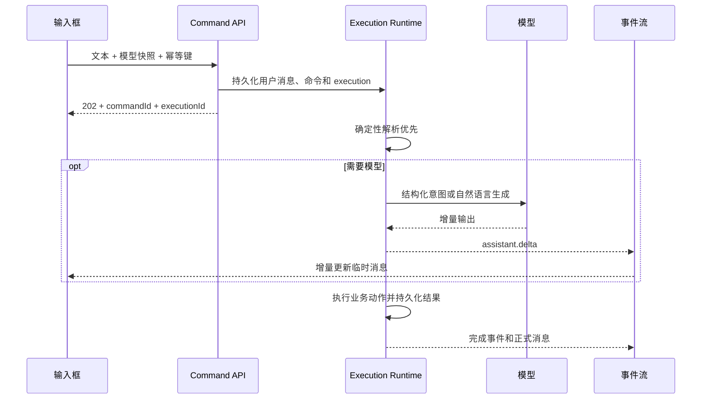
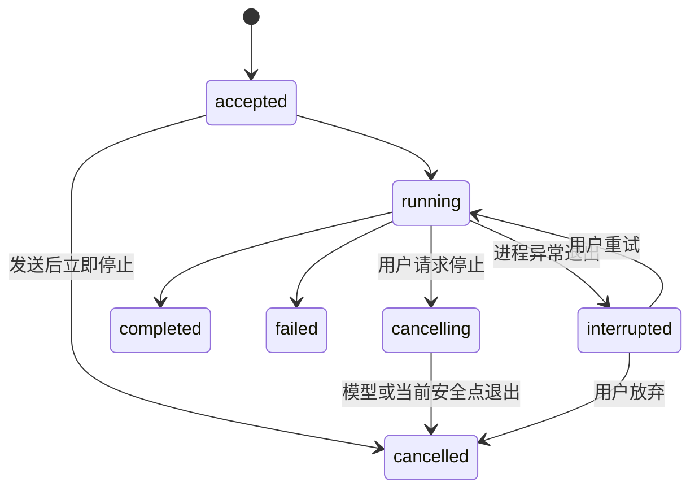

# R2 可取消流式执行、模型切换与批量发布设计

## 1. 背景

R2 题库整理会话已经支持自然语言命令、持久化上下文、候选题查看和单题发布，但交互执行链路仍存在四个缺口：

1. 用户发送命令后不能停止当前运行。
2. 输入框不能选择本次 Agent 使用的模型。
3. 候选题文件卡片缺少安全的一键发布入口。
4. 涉及大模型的 Agent 回复没有通过 SSE 增量展示。

仓库已有通用 Agent Execution Runtime，包含 execution 记录、服务端取消入口、可重放 SSE 事件和 `assistant.delta` 投影。然而，当前 `execute_curation_command` 在 HTTP 请求内同步完成意图识别、业务动作和回执持久化，绕过了这套运行时。只在前端增加 AbortController 或停止按钮，只能终止浏览器等待，无法保证服务端模型调用和发布副作用停止，也无法正确处理刷新和服务重启。

本设计将整理命令和批量发布接入统一 Execution Runtime，不引入临时的前端假停止，也不把已经稳定的“确定性规则优先、结构化模型兜底”重写成长期 ReAct Agent。

## 2. 目标与非目标

### 2.1 目标

- 每次整理命令拥有独立、持久化、可取消的 execution。
- 停止仅作用于当前 execution，会话随后可继续使用。
- 模型和思考强度作为会话偏好保存，并在发送时固化为 execution 快照。
- 自然语言模型输出通过现有 SSE 通道真实流式展示。
- SSE 断线后可按游标补发并去重，刷新后能恢复运行状态。
- 候选题卡片支持经过预检的一键发布、部分成功、停止和失败项重试。
- 取消、完成、失败、重启恢复和发布副作用之间具备明确的一致性边界。

### 2.2 非目标

- 不将所有确定性命令强制交给模型处理。
- 不为了制造视觉效果而把完整文本人工切片成伪流式输出。
- 不在本任务中把题库整理整体重写成长期 ReAct/LangGraph Agent。
- 不回滚已经成功提交的单题发布事务。
- 不承诺取消后撤回模型供应商已经计费或已经接收的 token；系统只保证停止本地消费、后续处理与尚未开始的副作用。

## 3. 方案对比与结论

### 3.1 方案 A：在同步命令接口上补前端取消

优点是改动小。缺点是只能取消 HTTP 等待，服务端任务可能继续运行，刷新和重启后状态不可恢复，发布副作用也无法建立可靠边界。

结论：不采用。

### 3.2 方案 B：整理命令接入统一 Execution Runtime

每次发送先持久化用户消息、命令和 execution，接口立即返回 `202`。后台 worker 执行确定性解析、必要的模型调用和业务动作，并把状态与输出写入可重放事件流。取消、模型快照、幂等、恢复和错误处理复用统一运行时。

结论：采用。

### 3.3 方案 C：重写为长期 ReAct Agent

扩展性强，但会扩大 R2 范围，并重写已经验证过的确定性命令解析、上下文组装和发布事务。简单的发布、拒绝命令也会增加不必要的模型调用、时延和不确定性。

结论：当前不采用；未来需要开放式工具编排时再评估。

## 4. 总体架构



整理命令不再把“HTTP 请求存活”当作运行生命周期。API 只负责接收、校验、去重和创建 execution；worker 才拥有模型流、状态转换与业务执行。

## 5. 运行状态机



### 5.1 停止语义

- 停止只取消当前 execution，不取消或删除整理会话。
- 用户已发送的消息保留；未完成的 assistant 内容标记为“已停止”。
- 未完成 assistant 内容只用于历史展示，不进入后续正式上下文。
- 收到 `execution.cancelled` 后会话恢复可输入状态；下一次发送创建新的 execution。
- 取消请求必须先持久化，再尝试取消本进程中的 asyncio task 和模型流。
- worker 在模型调用前后、命令阶段切换处以及每个发布项之间检查取消状态。
- 取消与完成竞争时，使用数据库条件更新决定唯一终态；已完成 execution 不得被覆盖为 cancelled。

### 5.2 发布安全点

单题发布是不可拆分事务。取消发生在事务开始前时不执行该题；事务已开始时完成当前题，再停止后续题。已经成功发布的题目不回滚。

### 5.3 重启恢复

- 进程启动时将遗留的 `accepted/running/cancelling` execution 恢复为 `interrupted`，但已经持久化取消请求的 execution 恢复为 `cancelled`。
- 系统不自动重复模型调用或发布动作。
- UI 为 interrupted 运行提供“重试”和“放弃”。重试创建新的 execution，沿用原命令内容和业务幂等信息。
- cancelled、failed、interrupted execution 不贡献完整 assistant turn；只有成功完成的命令问答对进入持久化上下文组装。

## 6. 模型选择与运行快照

### 6.1 会话偏好

输入框提供模型与思考强度选择器。可选项来自当前 workspace 中已启用且可用的 Provider Model。会话记录最后一次有效选择，以便重新打开时恢复。

### 6.2 Execution 快照

发送时将 `providerModelId` 和 `reasoningEffort` 固化到 execution configuration。运行中切换 UI 选择不会改变当前 execution，只影响下一次发送。

快照必须是通用 Execution Runtime 的显式配置，不能只读取 workspace 的当前绑定，也不能只藏在未经校验的输入 payload 中。历史消息和运行详情展示实际使用的模型。

### 6.3 内部模型角色

- 用户选择的模型用于含糊副作用命令的结构化意图解析，或普通问答的自然语言生成；普通问答不得为了路由先调用分类器。
- 上下文压缩仍属于 runtime middleware，可使用系统配置的摘要角色模型；普通问答先启动自然语言流，再压缩溢出的早期 turn，压缩不得阻塞首个 `assistant.delta`。它的调用和 token 使用单独记录，不伪装成用户选择模型的回答。
- 确定性命令不调用模型，也不为展示流式效果增加额外模型调用。

## 7. SSE 事件与消息投影

### 7.1 单一事件通道

继续使用 `GET /api/agent/sessions/{sessionId}/events`。所有事件包含 sessionId、executionId、递增事件 ID 和服务端时间。客户端通过 `Last-Event-ID` 或 `after` 恢复，按事件 ID 去重。

### 7.2 事件语义

- `execution.started`：创建运行中的临时 assistant 消息。
- `assistant.delta`：追加真实自然语言模型输出。
- `curation.command.resolved`：结构化意图和业务结果已经确定。
- `session.message.created`：正式 assistant 消息已持久化，替换临时消息。
- `execution.cancelling`：取消请求已持久化，UI 显示“正在停止…”。
- `execution.cancelled`：终态，临时消息标记“已停止”。
- `execution.interrupted`：进程重启或不可恢复中断，显示重试/放弃入口。
- `execution.completed`、`execution.failed`：正常终态。

### 7.3 结构化模型调用

输入先经过无副作用路由：明确命令由确定性 parser 处理；不含副作用词的普通表达直接进入 responder 流；只有包含发布、拒绝、重写、修改、删除、合并等潜在副作用且不能确定性解析的表达才进入 classifier。classifier 只返回 selector、feedback、clarification 等结构化计划，不包含普通问答 `response`。

意图分类产生的是内部结构化数据，不把 JSON/tool-call token 展示给用户。此阶段 UI 显示“正在理解你的指令”。完整校验后的业务状态和澄清结果仍通过 SSE 到达。只有 responder 的真实自然语言模型内容使用 `assistant.delta`，不得把完整文本人工切片伪装成模型流。

### 7.4 前端流式缓冲

客户端按 executionId 维护临时消息缓冲，对 delta 做帧级或短时间窗口合并，避免每个 token 触发整页渲染。正式消息到达后清理对应缓冲。刷新页面时通过持久化事件恢复已输出片段和终态。

## 8. API 与数据契约

### 8.1 提交整理命令

`POST /api/review/curation-sessions/{sessionId}/commands`

请求：

```json
{
  "text": "把推荐题都发布",
  "summaryVersion": 3,
  "idempotencyKey": "...",
  "providerModelId": "...",
  "reasoningEffort": "medium"
}
```

响应为 `202 Accepted`：

```json
{
  "commandId": "...",
  "executionId": "...",
  "status": "accepted"
}
```

同一幂等键重复提交必须返回相同 command 和 execution，不得重复创建模型调用或业务动作。

### 8.2 停止运行

继续使用 `POST /api/agent/executions/{executionId}/cancel`。接口幂等：终态 execution 原样返回；正在运行的 execution 先写入 cancelling/cancel-requested 状态，再触发 worker 取消。

### 8.3 批量发布

批量发布分为预检和执行：

- 预检返回可发布、已发布、需复核和不可发布的数量及 ID。
- 确认执行后创建独立 execution，并为每道题保存发布结果。
- 重试接口只接收上次失败项，并复用题目级业务幂等键。

### 8.4 持久化关系

- command 记录关联 session、execution、summary version、原始文本和终态。
- execution configuration 保存模型快照和思考强度。
- session preference 保存下次默认模型选择。
- 批量发布 operation 关联 execution；每个 item 保存 candidateId、status、errorCode 和业务幂等键。
- 用户消息发送时持久化，并关联 command/execution；正式 assistant 消息仅在完成后写入。

## 9. 前端交互

### 9.1 输入框

- 输入框工具栏显示模型选择器和思考强度。
- 空闲时按钮为“发送”；running 时替换为红色“停止”；cancelling 时显示“正在停止…”并禁用重复操作。
- 运行中锁定模型选择器。
- SSE 断线显示“正在重新连接”，不把网络断线等同于取消。
- cancelled 后立即恢复输入；interrupted 时提供“重试”和“放弃”。

### 9.2 候选题文件卡片

- 标题栏增加“一键发布”。
- 点击后先展示预检确认：例如“可发布 8 道，跳过 2 道需复核题”。
- 只自动发布状态为待发布且推荐为 `recommend_confirm` 的题目。
- 已发布题目跳过；建议拒绝、建议合并或存在风险的题目不自动发布。
- 文件项显示发布中、已发布、失败、已跳过状态。
- 部分失败时提供“仅重试失败项”。运行过程中可停止，停止后保留已成功结果。

前端视觉调整在实施阶段按项目约定使用 `ui-ux-pro-max`，但不得以视觉状态代替后端真实状态。

## 10. 错误处理与可观测性

- Provider 不支持立即取消时，系统停止读取流并取消本地后续处理；运行最终标记 cancelled，同时记录 provider cancel 是否为 best-effort。
- 模型不可用时，创建 execution 前返回可理解的校验错误；运行中模型失效则进入 failed。
- 所有日志、追踪和指标携带 sessionId、executionId、commandId、providerModelId，但不得记录密钥或完整敏感上下文。
- 记录首 token 延迟、总耗时、取消响应耗时、输入/输出 token、SSE 重连次数和批量发布成功/失败数。
- 结构化意图解析失败继续沿用安全澄清策略，不猜测目标题目，也不触发发布。

## 11. 测试与验收

### 11.1 后端

- 命令提交立即返回 accepted execution。
- 同一幂等键不重复创建 execution。
- running、完成竞争、模型流中和发布项之间的取消状态机测试。
- 取消后已提交的单题发布保留，后续题不执行。
- 服务重启把遗留运行恢复为 interrupted 或 cancelled。
- 模型和思考强度快照不会被后续会话偏好修改。
- SSE 事件递增、可补发、executionId 隔离且 delta 顺序正确。
- cancelled/failed/interrupted 的半成品回复不进入上下文。
- 一键发布预检、部分成功和失败项重试保持幂等。

### 11.2 前端

- 发送按钮与停止/正在停止状态正确切换。
- 模型选择保存、恢复，并在运行中锁定。
- delta 增量拼接、重连去重、正式消息替换和已停止标记正确。
- 一键发布预检确认、逐项状态、停止和仅重试失败项正确。
- 键盘发送、换行和无障碍状态提示不回退。

### 11.3 浏览器闭环

至少完成一次真实模型的“发送 → 流式输出 → 停止 → 刷新 → 继续发送”闭环，以及一次“批量发布 → 中途停止 → 仅重试失败/未完成项”闭环。默认无 Langfuse 环境不得影响验收。

## 12. 实施边界

实施应复用和扩展现有 AgentExecutionService、ProductEventStream、AgentEventProjector 与 `useAgentEvents`，避免创建第二套运行时或第二条 SSE 通道。数据结构允许开发阶段直接演进，但命名和职责必须面向后续其他 Agent 复用，而不是只为题库整理增加特例。
