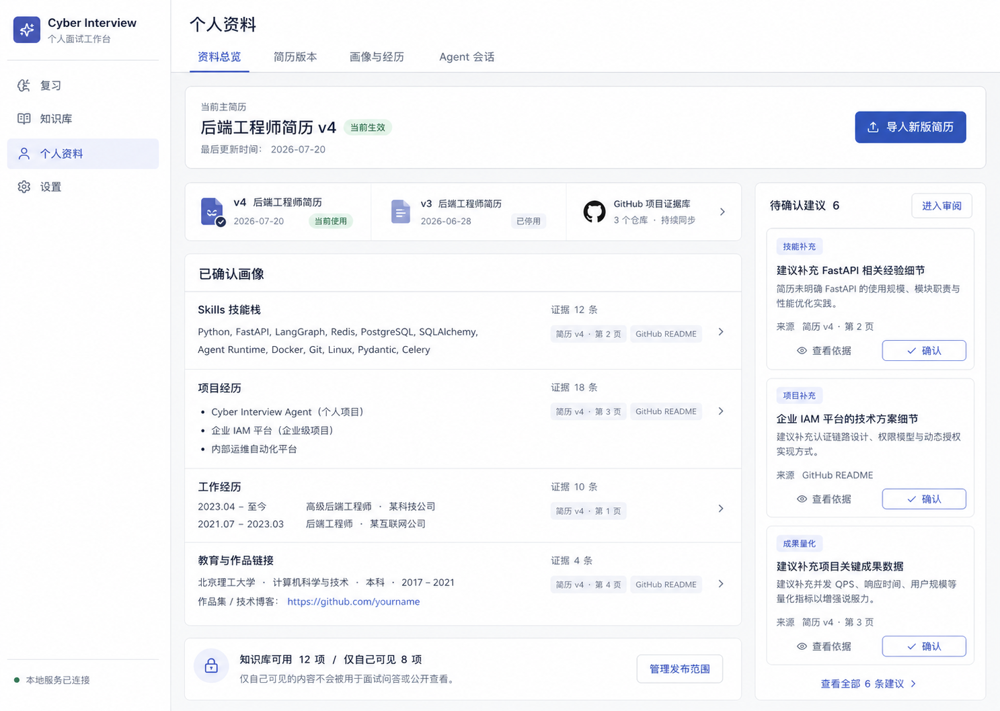
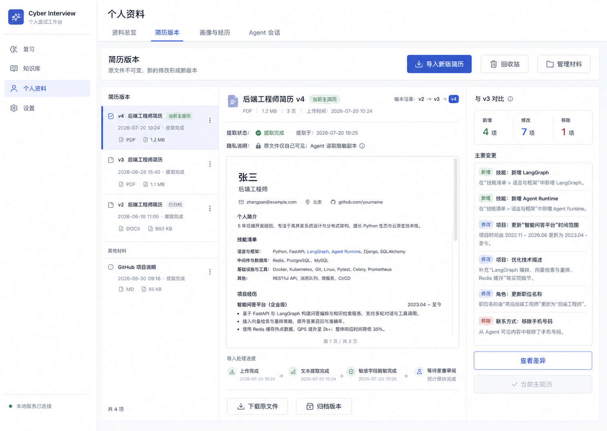
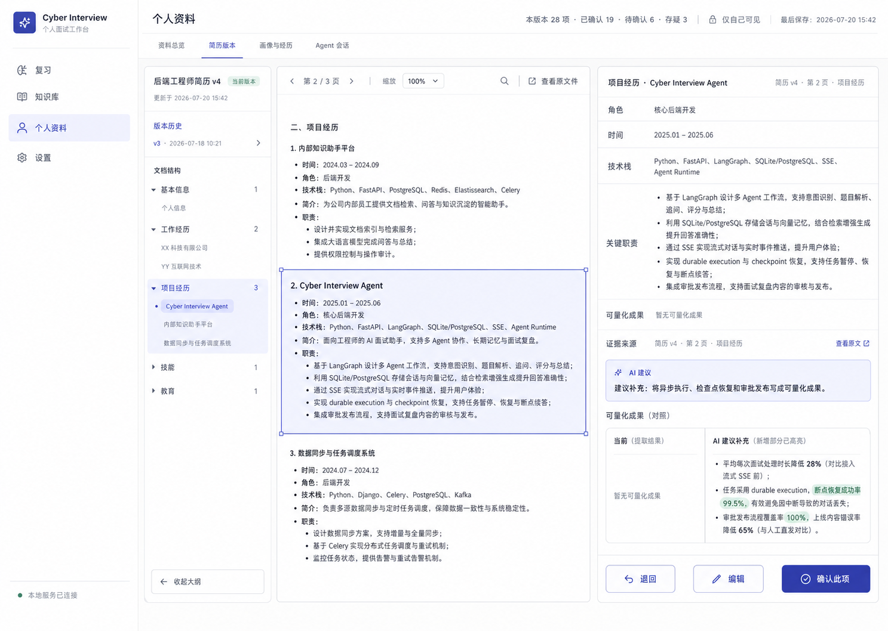
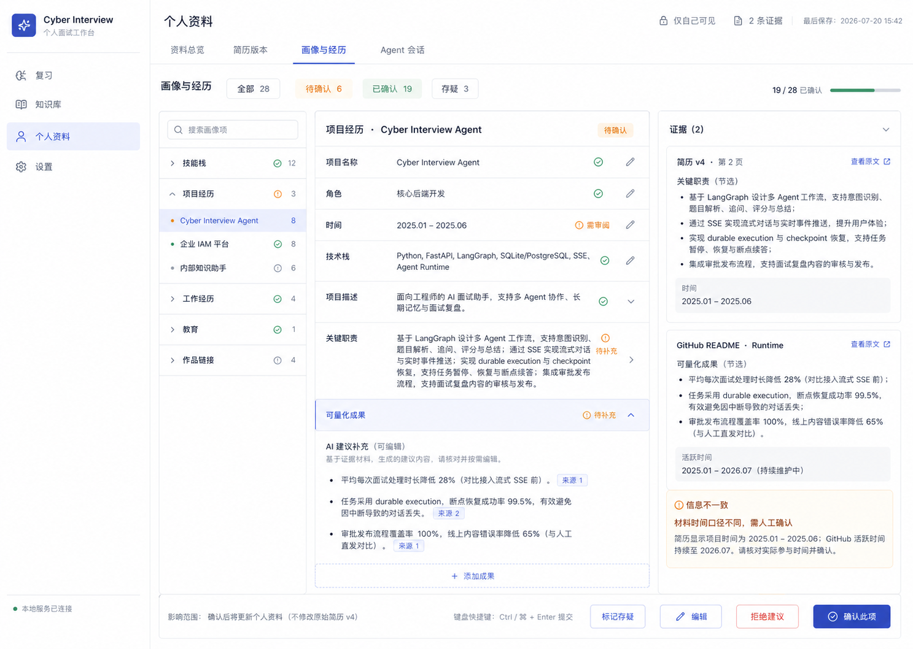
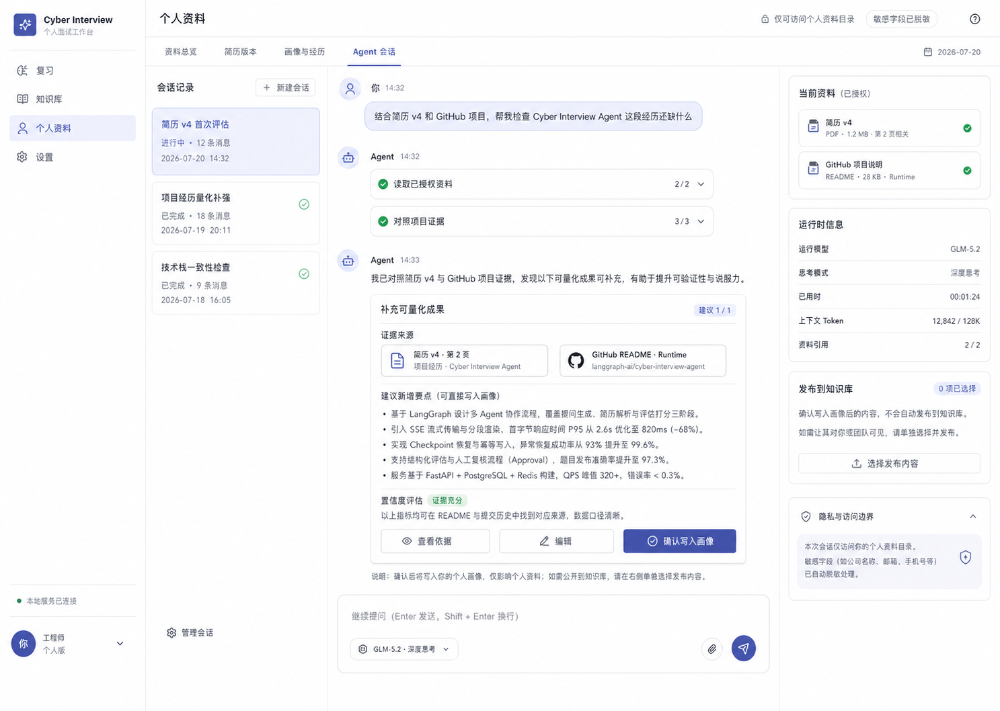
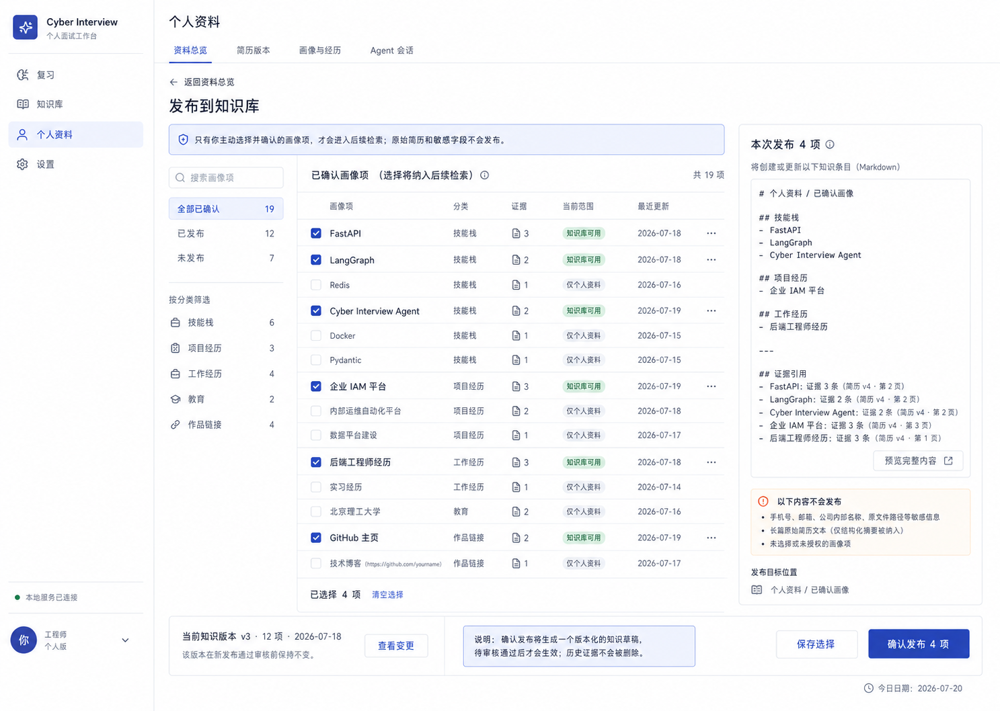

# R3 个人画像 Agent 设计规格

日期：2026-07-20

状态：Accepted；2026-07-24 按求职目标中心路线调整第一里程碑
产品阶段：R3 个人材料、结构化画像与受控下游查询

> 2026-07-24 产品纠偏：本规格建立的 Claim/Evidence、确认边界、受控
> Agent 和 confirmed-profile 仍然有效；用户主对象、画像来源、关系模型和
> 页面信息架构由
> `2026-07-24-r3-unified-personal-profile-correction.md` 补充。个人画像是一份
> 跨简历版本持续存在的统一能力档案，简历只是来源之一；如有冲突，以补充规格为准。

## 1. 背景

R0-R2 已建立 Workspace、Provider、统一 Agent Runtime、Session、Execution、LangGraph checkpoint、可重放产品事件、HITL、知识草稿与发布，以及题库和复习闭环。R3 在这些能力上建设个人画像，不另建一套 Agent Runtime。

个人画像不是由模型自由维护的一段简历文本，而是由不可变材料版本、可定位证据、用户确认的结构化事实、修改提案和执行回执共同组成的长期领域资产。它是求职目标、项目深挖、复盘和模拟面试的可信资料底座，不是用户最终要维护的一套内部数据模型。

R3 必须解决以下风险：

- 模型不能把推断或润色直接写成用户事实；
- 删除或替换简历不能让 Evidence、Claim 与下游岗位结论失去可解释关系；
- 长简历和多份材料不能全部塞进会话 checkpoint；
- 连续对话需要按需读取个人材料，但不能访问任意路径或扩大 Workspace scope；
- 多项修改和批量确认必须支持精确 Diff、幂等、停止、部分成功与恢复；
- 下游 Agent 只能消费用户已确认且在当前 Workspace 获准的个人事实。

本规格遵守既有的 Agent Context Assembly、统一可取消执行 Runtime、Agent Tool/写入边界、全路线能力分配 ADR，以及 `2026-07-24-job-target-centered-interview-preparation.md`。

## 2. 目标

R3 第一里程碑交付完整的简历纵向闭环：

```text
上传简历
→ 创建不可变版本
→ 解析为 Evidence
→ 提取 Claim 候选
→ 用户逐项审核
→ 简历助手评估、解释和资料整理
→ 用户确认精确修改
→ confirmed-profile application contract
→ R4 求职目标按明确范围读取
```

完成后必须满足：

- 原始简历、材料版本、Evidence、Claim 和 Proposal 相互可追溯；
- 未确认候选不能成为正式画像；
- pending、rejected 和未获准敏感信息不能进入下游上下文；
- 已确认画像可以通过受控查询稳定提供给 R4-R6，不要求先发布到 Active Knowledge；
- Session、Execution、Checkpoint 与领域事实职责清晰；
- 长材料使用 Evidence Offload，而不是长期占用消息上下文；
- 用户可以观察执行、停止、重试、刷新和恢复。

## 3. 非目标

R3 第一里程碑不实现：

- 通用自主 ReAct 写入、通用 Time Travel、通用自主 Planner 或动态 Supervisor；
- 任意文件读写 Tool、扫描 PDF OCR、向量数据库；
- GitHub OAuth 与持续同步、博客站点自动爬取；
- 自动修改长期记忆、正式 Todo 执行系统；
- 自动发布个人知识、自动删除或覆盖旧 Claim；
- Claim 级知识发布范围、Active Knowledge 撤销和通用个人资料共享；
- 求职目标、JD 要求映射、项目深挖、项目讲解卡和完整模拟面试；
- 从画像会话派生子会话；
- 跨 Workspace 或跨用户材料访问。

## 4. 总体架构决定

### 4.1 Claim/Evidence 中心模型

R3 采用 Claim/Evidence-centric 架构，不采用文档中心或会话中心架构。

```text
PersonalMaterial
  → PersonalMaterialVersion
    → EvidenceSpan
      → ProfileClaimVersion
        → ProfileProposal / ProfileActionPlan
          → ConfirmedProfileContext
            → R4-R6 bounded consumer

Deferred extension:
ProfileClaimVersion → PublicationSelection → KnowledgeDraft → ActiveKnowledge
```

文档中心难以表达同一事实跨版本、跨材料的支持和冲突；会话中心会让正式画像依赖消息历史和 checkpoint 生命周期。Claim/Evidence 模型可以独立管理来源、确认、冲突和版本。通用知识发布保留为后续扩展，但不再是下游消费门禁。

### 4.2 写入边界

R3 Agent 不获得更新/删除 Claim、删除材料、设置主简历、发布知识、写任意文件、创建 Todo 或修改长期记忆的 Tool。

领域变更统一经过：

```text
模型生成结构化 Proposal
→ 服务端验证
→ 固化不可变输入快照
→ 生成精确 Diff
→ 用户显式确认
→ 确定性领域服务执行
→ 保存逐项 Receipt
```

### 4.3 Time Travel 与 Plan-and-Execute

R3 不建设通用 Time Travel。Execution 恢复由 checkpoint 承担，页面回放由持久 Event cursor 承担，材料和画像历史由领域版本承担，重做任务通过不可变快照上的新 Execution 表达。

R3 只采用受约束 Plan-and-Execute：固定领域 Graph；复杂多项修改生成结构化 `ProfileActionPlan`；用户选择并确认计划项目；确定性执行器逐项执行。模型不能自由规划无限步骤或直接执行写操作。

## 5. 领域模型

### 5.1 PersonalMaterial

```text
id
workspace_id
type: resume | github | blog | research | project_document
title
primary_role
current_version_id
lifecycle_status: active | archived
version
created_at
updated_at
```

第一里程碑实现 `resume`。同一 Workspace 同一 `primary_role` 最多指向一份活动材料。

### 5.2 PersonalMaterialVersion

```text
id
material_id
version_number
source_type: upload | derived_draft
file_name
mime_type
content_sha256
storage_ref
processing_status
derived_from_version_id
created_by
created_at
```

处理状态：

```text
uploaded → parsing → parsed → extracting → ready
                     ↘ parse_failed / extraction_failed
```

版本不可原地修改。AI 润色只能创建 `derived_draft` 派生版本，经用户确认后才能成为正式版本或主简历。

### 5.3 EvidenceSpan

```text
id
material_version_id
section
start_offset
end_offset
sanitized_text
content_sha256
sensitivity
created_at
```

Evidence 必须绑定不可变版本。Agent 上下文默认只保存 Evidence ID、类型和摘要；正文通过只读 Tool 有界加载。删除原始内容后，Evidence 变为 tombstone，不保留可恢复敏感正文。

### 5.4 ProfileClaim 与 ProfileClaimVersion

`ProfileClaim` 是稳定逻辑事实：

```text
id
workspace_id
claim_type
current_confirmed_version_id
version
created_at
updated_at
```

第一里程碑支持 skill、project、experience、education 和 link。

`ProfileClaimVersion`：

```text
id
claim_id
value
status: proposed | confirmed | rejected | superseded
support_status: supported | conflicted | unsupported
evidence_refs[]
source
expected_previous_version
created_at
confirmed_at
```

`status` 表示用户决定，`support_status` 表示证据状态。原材料永久删除后，用户确认过的 Claim 可以保持 `confirmed`，但必须转为 `unsupported`。新材料与现有 Claim 冲突时创建候选版本和冲突关系，不自动覆盖已确认版本。

### 5.5 ProfileProposal

```text
id
proposal_type
target_claim_id
base_claim_version_id
proposed_value
reason
evidence_refs[]
status: pending | accepted | rejected | superseded
created_by_execution_id
created_at
```

评估、润色和一致性检查只生成 Proposal。用户可以直接接受或编辑后接受；编辑值形成新 Claim Version，并保留与原 Proposal 的关系。

### 5.6 ProfileActionPlan

```text
id
session_id
execution_id
request_summary
base_profile_version
selection_snapshot
items[]
status
version
expires_at
created_at
```

模型先产生尚未持久化的 `ProfileActionPlanProposal`。服务端校验通过后才创建领域 `ProfileActionPlan`。状态机与全路线能力 ADR 保持一致：

```text
proposed → validated → awaiting_confirmation → executing
                                                ├─ completed
                                                ├─ partially_completed
                                                ├─ failed
                                                └─ cancelled
```

如果目标 Profile 或 Claim 版本变化，计划进入 `expired`，必须重新计算 Diff。

Item 至少包含 `item_id`、operation、target、expected_version、before、after、evidence_refs、status、receipt_id 和 error_code。

### 5.7 ConfirmedProfileContext

`ConfirmedProfileContext` 是 application service 返回的有界读取模型，不是新的持久化真相：

```text
workspace_id
profile_version
requested_categories[]
confirmed_claims[]
evidence_refs[]
excluded_sensitive_fields[]
```

它只投影当前 confirmed Claim Version，排除 pending、rejected、superseded 和未获准敏感字段；默认不包含完整 Evidence 正文。求职目标等调用者必须携带明确的消费目的和请求范围，原文继续通过受限 Tool 按需读取。

### 5.8 PublicationSelection（预留扩展）

```text
id
workspace_id
claim_version_ids[]
excluded_sensitive_fields[]
profile_version
status
created_at
```

现有 schema 作为未来通用发布、导出或共享的预留扩展点。若后续启用，发布选择仍独立于 Claim 确认，并进入已有 Knowledge Draft/HITL/Publication 流程；但 R4-R6 读取已确认画像不依赖它。

## 6. 存储与状态所有权

| 状态 | 所有者 |
|---|---|
| 原始文件 | Workspace 私有内容寻址材料存储 |
| 材料元数据与版本 | Personal Material Repository |
| Evidence 与引用 | Evidence Repository |
| Claim、Proposal、Action Plan、Receipt | Profile Repository |
| 当前 Material/Claim/Proposal 焦点 | `profile_agent_context` 领域投影 |
| Session 正式消息 | `agent_messages` |
| Execution 与可重放产品事件 | Agent Runtime Repository |
| Agent 循环消息与中断点 | LangGraph checkpoint |
| Tool 安全审计 | `tool_audits` |
| ConfirmedProfileContext 读取投影 | Profile application service |
| 未来 Knowledge Draft、Publication、Active 投影 | Knowledge 领域 |
| 页面筛选、展开和未提交输入 | 前端本地状态 |

Checkpoint 不保存完整简历、完整画像、正式 Action Plan 或发布选择。删除 Session 不删除材料、Claim、Proposal Receipt 或知识资产。

原文件使用内容哈希生成不可猜测存储引用，位于 Workspace 私有材料目录，不进入 Knowledge Vault，不允许模型传入任意路径读取。

## 7. Context Offload

R3 实现领域 Evidence Offload，而不是通用运行时 Artifact Offload。

上下文装配优先顺序：

1. 当前用户请求；
2. 当前焦点 Material、Version、Claim、Proposal 的稳定 ID；
3. 已确认画像的有界摘要；
4. 相关 Evidence 摘要和引用；
5. 最近完整对话 turn；
6. 持久化结构化会话摘要；
7. 只读 Tool 按需加载正文。

第一版不引入向量数据库。Resume 范围内使用材料、版本、章节、Claim 类型、稳定引用和有界关键词检索；多来源语义检索出现真实需求后再评估向量索引。

## 8. Agent 角色

| Agent | 模型用途 | 输入/输出 | Tool | State |
|---|---|---|---|---|
| `profile_extraction` | 新增同名绑定 | 指定版本/Evidence → Claim 候选 | 无 | 默认 `AgentState` |
| `profile_assessment` | 新增同名绑定 | 材料/Claim 快照 → Assessment/Proposal | 无 | 默认 `AgentState` |
| `profile_chat` | 复用 `agent_chat` | 会话与领域焦点 → 最终回答 | 最小只读 allowlist | 默认 `AgentState` |
| `profile_action_planner` | 先复用 `profile_assessment` | 修改请求/快照 → Action Plan Proposal | 默认无，必要时最小只读 | 默认 `AgentState` |

`ProfileActionPlan` 是领域数据，不属于 `AgentState`。Planner 不持有跨 Execution 隐藏计划，也不执行写操作。

## 9. Graph 设计

### 9.1 profile.ingest

后台 Graph，每个材料版本一条 Execution，不创建用户可见的对话 Session。为复用现有 Execution/Event/Tool Audit 的 Session 外键和恢复能力，Runtime 内部为每个材料版本创建隐藏的 `profile.ingest` system session；它不进入画像会话列表、不保存对话消息，也不接受用户聊天输入。

```text
校验文件
→ 保存不可变版本
→ 确定性解析、脱敏和切片
→ 保存 Evidence
→ profile_extraction
→ 校验 Evidence 引用
→ 幂等保存 Claim 候选
→ ready / failed
```

解析失败保留版本；提取失败保留 Evidence。重试从已持久化安全阶段继续，不重复上传、Evidence 或 Claim。

### 9.2 profile.assess

```text
锁定 Material/Claim 快照
→ profile_assessment
→ 校验结构化输出
→ 幂等保存 ProfileProposal
→ 投影会话卡片
```

失败不创建正式 Claim，也不留下半完成 Proposal。

### 9.3 profile.manage

```text
持久化用户消息和领域焦点
→ 安全路由
   ├─ 简单问答：profile_chat
   ├─ 明确单项命令：确定性领域命令
   └─ 多项复杂修改：profile_action_planner
                          ↓
                    ProfileActionPlan
                          ↓
                     用户显式确认
                          ↓
                    确定性执行器
```

停止只停止当前 Execution。未完成流式输出不作为正式消息进入后续上下文，已确认领域事实不受 Execution 失败影响。

### 9.4 confirmed-profile query

同一 Workspace 中由用户明确创建的求职目标通过 application service 请求已确认画像：

```text
consumer purpose + requested categories
→ Workspace 与消费范围校验
→ 当前 confirmed Claim Version
→ 敏感字段过滤
→ 有界 Profile Context
```

该路径不复制 Profile 领域事实，不读取 pending/rejected Proposal，不把完整简历放入 checkpoint，也不要求先发布到知识库。

### 9.5 knowledge.publish（后续可选）

需要跨模块通用检索、导出或共享时，仍复用既有发布边界：

```text
PublicationSelection
→ 发布预览
→ Knowledge Draft
→ 独立 HITL
→ Vault Version
→ Active Knowledge
```

不创建能够自行发布知识的 Profile Publish Agent。该扩展不属于 R3 第一里程碑，也不阻塞求职目标和训练。

## 10. Tool 设计

第一里程碑定义以下只读 Tool：

- `list_personal_materials`
- `search_personal_materials`
- `read_personal_evidence`
- `read_personal_evidence_batch`
- `get_profile_claims`
- `get_profile_claim_evidence`
- `compare_material_versions`

`profile_extraction` 和 `profile_assessment` 无 Tool；`profile_chat` 按任务获得材料、Evidence、Claim 和版本对比的最小子集，不读取 Active Knowledge 或发布状态；Planner 默认消费已装配上下文，确需补证时才使用最小只读子集。

Tool Schema 只包含业务查询参数。`workspace_id`、`session_id`、`run_id`、`allowed_tools` 和 `allowed_scopes` 由服务端 `AgentContext` 注入，模型不能覆盖。Tool 必须验证稳定资源 ID 属于当前 Workspace。

每个 `profile_chat` Execution 默认最多 6 次 Tool Call；相同 Tool 与规范化参数最多 2 次；两条及以上 Evidence 使用批量读取，一次最多 12 条；单次结果最多 50 项，单条正文摘录最多 2,000 字符。超过调用预算时，中间件阻止额外调用并把受控 ToolMessage 返回模型，模型必须根据已有结果回答或请求缩小范围，不能因普通预算耗尽直接让 Execution 失败。No Progress Middleware 将 Tool 名称和规范化参数纳入指纹。

Tool 返回统一 envelope：

```json
{
  "status": "ok",
  "items": [],
  "evidenceRefs": [],
  "truncated": false,
  "nextCursor": null
}
```

失败使用稳定错误码，不返回数据库异常、路径、Provider 原文或 secret。

## 11. Message、Event 与 Tool Audit

### 11.1 Agent 协议消息

R3 直接使用 LangChain 标准 `HumanMessage`、`AIMessage`/`AIMessageChunk`、`AIMessage.tool_calls` 和 `ToolMessage`，不建立平行协议。

`create_agent` 负责：

```text
模型接收 Tool Schema
→ AIMessage 产生 tool_calls
→ Middleware 校验权限和 HITL
→ 标准 Tool 执行
→ ToolMessage 回到消息状态
→ 模型继续生成或再次调用 Tool
```

`ToolStrategy(response_format)` 可能利用 Provider Tool Calling 生成结构化输出，但不是业务 Tool，不产生业务 Tool Audit 或产品 Tool Event。

### 11.2 产品 Message

产品 `MessageRecord` 只保存用户可见的正式请求、完成后的 Agent 回答和 Claim/Proposal/Action Plan/Receipt 等 typed card。内部 ToolMessage、模型原始结构化 JSON 和未完成流式文本不直接保存为正式产品 Message。

### 11.3 产品 Event

R3 新增：

```text
profile.ingest.parsing
profile.ingest.extracting
profile.claims.proposed
profile.action_plan.created
profile.action_plan.item_completed
agent.tool.started
agent.tool.completed
agent.tool.failed
```

Tool Event payload 只允许 execution_id、tool_call_id、tool_name、purpose、status、result_count 和 error_code。原始参数、简历/Evidence 正文、Tool 原始结果、Provider 请求响应、敏感 Profile 值和模型推理不得进入 Event。

UI 将其显示为“正在检索个人材料”“已对比两个简历版本”等安全阶段。完整审计只在运行详情或开发诊断中查询。

### 11.4 Tool Audit

Tool Policy Middleware 在执行前后保存：

```text
audit_id
execution_id
tool_call_id
agent_role
tool_name
status: started | completed | failed | denied
resource_scope
input_digest
result_digest
latency_ms
error_code
created_at
finished_at
```

Audit 保存摘要和哈希，不保存敏感 Tool 原始输入输出。

## 12. Session、Execution 与 Checkpoint

| 对象 | Thread ID |
|---|---|
| `profile.manage` 外层 Graph | `<session_id>` |
| `profile_chat` | `<session_id>:profile_chat` |
| `profile_assessment` | `<session_id>:profile_assessment` |
| `profile_action_planner` | `<execution_id>:profile_action_planner` |
| `profile.ingest` | `<material_version_id>` |
| `profile_extraction` | `<material_version_id>:profile_extraction` |

多个兄弟 `profile.manage` Session 共享领域事实但不复制 checkpoint；上传、解析和提取没有用户可见 Session，只使用与材料版本绑定的隐藏 system session 承载 Runtime 事实；Planner 不保留跨 Execution 隐藏计划；删除用户会话不删除领域资产。

第一版所有 role Agent 使用默认 `AgentState`。只有出现同一 Agent loop 内产生、后续步骤消费、必须随 checkpoint 恢复且不属于领域事实的状态时，才新增自定义 `state_schema`。

## 13. 页面与用户流程

### 13.1 简历总览

首先展示当前简历、下一步任务、确认信息的用途和隐私边界。版本、原文来源和下游使用说明属于次级信息；不得在首屏直接展示领域表名、Markdown frontmatter、字符偏移或内部状态字段。

### 13.2 材料与版本管理

支持 PDF、DOCX、Markdown 上传，解析/提取进度，失败重试，版本对比，设置主简历，AI 派生草稿，归档、恢复和永久删除预检。扫描 PDF 无文本时返回明确可恢复错误，不隐式启用 OCR。

### 13.3 简历要点确认工作台

支持查看 Evidence，接受、编辑后接受、拒绝，标记 Evidence 不准确，查看冲突，单项/批量确认，以及从 Claim 发起讨论。批量接受基于显式 Selection Snapshot 和 Diff，部分成功逐项展示。

### 13.4 简历助手工作区

支持解释识别结果、定位原文、发现冲突、整理经历和生成待确认修改。它是资料维护助手，不承担无目标岗位的差距分析、项目深挖或完整模拟面试。新会话不复制父 checkpoint，通过领域 ID 装配已确认画像和相关 Evidence。

### 13.5 下游使用说明

概览说明已确认信息会在用户创建求职目标并选择简历后用于岗位分析和训练；pending/rejected 项不会使用。调用外部模型前显示本次会使用的岗位与个人资料范围。知识发布范围页面延期，不作为当前一级或二级入口。

## 14. 前端视觉与交互设计契约

### 14.1 视觉方向

R3 采用 `light + professional + task-first + progressive-disclosure workspace`。在领域能力建设阶段使用的高密度 Evidence 工作台保留为实现基础，但 C 端主路径采用 `variance 3 / motion 2 / density 5`，优先让用户理解“现在是什么、下一步做什么、完成后有什么用”。

- **浅色优先**：延续当前生产页面的浅灰 Canvas、白色 Surface、蓝色主操作和克制的语义状态色，不把 R3 做成独立主题；
- **任务与内容优先**：页面层级依靠布局、留白、字号、分隔和选中态表达，颜色只辅助状态；内部领域模型不能成为一级导航；
- **渐进披露**：默认只展示完成当前任务所需的信息；版本处理流水线、Evidence 定位、运行状态和调用事实按需展开；
- **中等密度**：待确认队列允许保持效率，但正文、解释、操作和隐私提示必须保留清晰呼吸空间；
- **工具型产品而非展示型网站**：禁止 Landing Page 构图、紫粉营销渐变、重玻璃拟态、装饰性 ambient glow、超大标题和无意义动画；
- **与 R0-R2 连续**：复用现有 App Shell、导航、Button、Badge、Card、Dialog、Composer、Focus 和响应式 primitives，不引入第二套 UI 框架。

`ui-ux-pro-max` 检索给出的 Modern Dark、紫粉配色、Review/Rating 电商模式与已确认方向和当前代码不符，明确拒绝；采用其适用于本项目的轻动效、高密度、渐进披露、44px 目标、可见 Focus、异步反馈和响应式规则。

视觉权威顺序：

1. `frontend/src/app/global.css` 已有语义 Token 与基础组件；
2. 本节定义的信息层级、交互和响应式契约；
3. R3 概念效果图。

效果图用于页面区域职责、信息层级、状态显隐和主要操作顺序，不作为固定数据、固定文案或逐像素截图基线。若效果图与服务端事实、可访问性或本节 Token 冲突，以前两项为准。

用户界面使用任务语言，代码、API 和架构文档继续保留精确领域术语。固定映射如下：

| 领域术语 | 用户界面 |
|---|---|
| Personal Material | 简历 |
| Claim / Profile Claim | 简历要点 / 已确认信息 |
| Evidence | 简历原文 / 信息来源 |
| Profile Agent Session | 简历助手 / 对话记录 |
| Tool / Context / Call Count | 运行详情（默认折叠） |
| Confirmed Profile Context | 岗位分析会使用的已确认资料 |

不得向普通页面直接展示 `category`、`confidence`、`sub_skills` 等 Schema 字段名、JSON、Markdown frontmatter、字符 offset 或英文状态枚举。字段需要出现时转换为自然语言；新建建议只展示建议内容，只有更新已有信息时才展示 before/after Diff。

### 14.2 设计 Token

R3 首版直接继承现有 Token，不新建 R3 专属 raw hex：

| 语义 | Token | 当前值/规则 |
|---|---|---|
| 页面背景 | `--canvas` | `#f4f6f8` |
| 主表面 | `--surface` | `#ffffff` |
| 次级表面 | `--surface-subtle` | `#f8fafc` |
| 选中/聚焦表面 | `--surface-active` | `#eef2ff` |
| 主文字 | `--text` | `#172033` |
| 次级文字 | `--text-muted` | `#5f6b7a` |
| 辅助文字 | `--text-soft` | `#7b8794` |
| 边框 | `--border` / `--border-strong` | `#dfe4ea` / `#c8d0da` |
| 主操作 | `--primary` / `--primary-hover` | `#4056b4` / `#34489a` |
| 主操作浅底 | `--primary-soft` | `#e8ecff` |
| 成功/已确认 | `--success` / `--success-soft` | 现有绿色语义对 |
| 待确认/冲突 | `--warning` / `--warning-soft` | 现有琥珀语义对 |
| 失败/拒绝/删除 | `--danger` / `--danger-soft` | 现有红色语义对 |
| 键盘焦点 | `--focus` | 3px 可见 Focus Ring |
| 圆角 | `--radius-sm/md/lg` | 4 / 6 / 8px |
| 阴影 | `--shadow-sm/md` | 仅用于可交互卡片、浮层和层级分离 |
| 间距 | `--space-1` 至 `--space-12` | 4px 基础、8px 节奏 |
| Motion | `--duration-fast` / `--duration` | 150 / 220ms |

组件只能消费语义 Token，不在页面内新增任意颜色、圆角、阴影、间距或 z-index。状态色必须同时配合图标、文字或 Badge，不得只用颜色表达 supported、conflicted、unsupported、confirmed 或 rejected。

### 14.3 字体与内容层级

- 字体继续使用 `Inter, ui-sans-serif, -apple-system, BlinkMacSystemFont, "Segoe UI", sans-serif`；代码、哈希和固定宽度数据使用现有 `--font-mono`；
- 页面 H1 使用现有 28px 级别，区块 H2 约 18px，卡片/字段 H3 16px；不为 R3 引入营销型 Display 字号；
- 正文基线 16px、行高约 1.55；密集列表和元数据可以使用 12-14px，但主要阅读文本不得低于 14px；移动端表单输入保持至少 16px；
- 时间、版本号、计数和 Token 使用 tabular figures，避免流式更新引起宽度跳动；
- Evidence 和长文本优先换行或展开查看，截断必须提供可键盘访问的完整内容入口。

### 14.4 Shell、导航与页面布局

桌面继续使用现有 240px 左侧 App Shell；“我的简历”作为一级入口，页内固定使用以下二级标签：

```text
概览 | 简历与版本 | 确认简历要点 | 简历助手
```

当前 R3 不提供知识发布范围页面。总览以自然语言说明：只有用户已经确认、属于当前 Workspace 且符合本次用途的数据，才会在后续求职目标中被受控读取；完整使用范围由实际创建求职目标时再次确认。

页面布局契约：

| 页面 | ≥1200px | 768-1199px | ≤767px |
|---|---|---|---|
| 资料总览 | 主画像区 + 320-360px 待确认侧栏 | 主区 + 可折叠建议区 | 单列，建议置于画像摘要之后 |
| 简历版本 | 版本列表 + 文档预览 + 差异/操作栏 | 版本列表 + 文档，差异进入抽屉 | 单列版本卡；预览和差异为全宽子页面 |
| Evidence 详情 | 文档大纲 + 原文定位 + 结构化检查栏 | 大纲折叠，检查栏可替换/抽屉 | 原文、结构化字段、操作按步骤纵向排列 |
| 画像审核 | 分类树 + Claim 编辑区 + Evidence 栏 | 分类树 + Claim；Evidence 抽屉 | 分类列表 → Claim 详情 → Evidence 子页面 |
| Agent 会话 | 会话列表 + 对话主区 + 运行/授权栏 | 会话列表 + 对话；运行栏抽屉 | 单列对话；会话和运行信息从顶部入口打开 |

宽屏三栏使用 `minmax(0, ...)`，主任务区域始终最大。右栏负责 Evidence、运行信息或 Diff，不和中栏重复展示同一份可编辑状态。页面只保留一个主滚动区；侧栏需要独立滚动时必须有明确高度边界，不能形成互相争抢的多层滚动。

### 14.5 核心组件规范

- **Material/Version Row**：文件类型、版本、时间、处理状态和主简历状态同层展示；当前版本使用左侧强调线或浅蓝背景，不用大面积渐变；
- **Claim Row/Card**：字段值是主层级，Claim 类型、Evidence 数量和支持状态为辅助层级；编辑、接受、拒绝均绑定稳定资源 ID；
- **Evidence Card**：显示来源材料、版本、页/章节、引用片段和“查看原文”；敏感正文默认裁剪，展开属于显式操作；
- **Conflict Card**：并列显示来源、值和时间，警告使用琥珀色边框加图标/文字，不使用红色模拟系统故障；
- **Proposal Card**：明确区分“当前值”和“AI 建议”，默认展示理由与 Evidence；确认按钮不得写成模糊的“应用全部”；
- **Action Plan Card**：逐项显示 before/after、expected version、选择状态和执行结果；部分成功不能只显示一个全局 Toast；
- **Tool Stage Row**：只显示安全的“读取授权资料”“对照项目证据”等公开阶段、数量和完成状态；默认可折叠，不展示 Tool 原始参数、结果或模型推理；
- **Downstream Use Summary**：用自然语言说明已确认资料将在用户创建求职目标后如何被使用；不展示内部查询协议，也不让用户在 R3 预先维护一套与实际岗位脱节的发布选择；
- **Composer**：复用现有紧凑聊天 Dock，输入为主层级，模型/思考强度渐进披露，发送/停止状态明确；
- **Dialog/Drawer**：仅用于确认、差异、Evidence 和窄屏辅助信息，不承载一级导航；有标题、关闭、Esc、Focus Trap 和返回焦点。

每个页面只保留一个 Primary CTA。删除、拒绝与普通操作在颜色和空间上分离；永久删除必须通过影响预检，不把危险操作藏在无标签图标菜单中。

### 14.6 状态、反馈与 Motion

- 点击、键盘提交和选择在 100ms 内产生视觉反馈；异步等待超过 300ms 显示 Skeleton、Stage 或 Progress，不允许空白等待；
- 上传和 `profile.ingest` 展示确定性阶段：上传、文本提取、脱敏、Claim 提取、等待审核；失败阶段提供原因和重试入口；
- `agent.tool.*` Event 只投影安全 Tool Stage，不能模拟 Chain of Thought；
- 流式回答使用临时气泡；`session.message.created` 对账后替换为正式消息，避免双份内容；
- Motion 使用现有 150/220ms Token，以 opacity/transform 为主，只表达打开、关闭、选中、完成和内容替换；禁止装饰性循环动画；
- `prefers-reduced-motion` 下取消非必要位移、Pulse 和自动滚动动画，但保留即时状态变化；
- 错误信息在对应字段、卡片或 Execution 附近显示“发生了什么 + 如何恢复”，不能只在页面顶部 Toast。

### 14.7 响应式与无障碍

验收宽度至少覆盖 390、768、1024 和 1440px，并补充移动横屏检查：

- 390px 无页面级横向滚动；宽表格改为卡片或字段列表，不能要求用户横向拖动完成主要任务；
- 触控/点击目标至少 44×44px，相邻危险操作保持至少 8px 间距；
- 普通文本对比度至少 4.5:1，大型图标和非文本 UI 至少 3:1；
- 键盘可完成标签导航、版本选择、Claim 审核、Evidence 展开、Action Plan 选择和 Dialog 关闭；
- 路由切换后 Focus 移到页面 H1/主内容，关闭抽屉或 Dialog 后返回触发控件；
- 动态进度和 Tool Stage 使用适当 `aria-live`，Toast 不抢占焦点；
- 展开、选中、待确认、冲突、只读和禁用状态具有正确语义属性；
- 50 项以上列表使用分页、渐进加载或虚拟化；异步内容预留空间，避免明显 Layout Shift。

### 14.8 概念参考图

资料总览：



简历版本管理：



简历 Evidence 定位与结构化详情：



Claim 审核工作台：



个人画像 Agent 会话：



知识发布范围（历史概念参考，当前里程碑延期）：



### 14.9 UI/UX 实施门禁

1. **实施前**：基于本节和现有 `global.css` 输出页面区域矩阵、共享组件清单、状态矩阵和响应式折叠规则；不得先写各页面私有 CSS 再统一；
2. **实施中**：优先完成 Profile Shell、Tabs、三栏 Workspace、Claim/Evidence/Proposal/ActionPlan、Tool Stage、Drawer 和 Composer primitives；每个纵向切片同时完成桌面与窄屏，不把响应式留到最后；
3. **切片审查**：在真实数据和长文本下检查区域职责、Loading、Empty、Error、Conflict、Partial Success、Interrupted 和 Permission Denied；
4. **最终审查**：使用 accessibility、loading、navigation、responsive 和 performance 清单检查真实页面，再执行完整浏览器验收；
5. **还原边界**：视觉结果必须达到参考图的信息层级和感知质量，但不做逐像素截图匹配，也不为参考图中的示例数字伪造前端状态。

## 15. API 设计

### 15.1 材料与版本

```http
POST /api/workspaces/{workspaceId}/profile/materials
GET  /api/workspaces/{workspaceId}/profile/materials
POST /api/profile/materials/{materialId}/versions
GET  /api/profile/materials/{materialId}/versions
GET  /api/profile/material-versions/{versionId}
POST /api/profile/materials/{materialId}/archive
POST /api/profile/materials/{materialId}/restore
POST /api/profile/materials/{materialId}/primary
```

上传返回 `202 Accepted`，包含 materialId、versionId、executionId 和 processingStatus。

### 15.2 Claim 与 Proposal

```http
GET  /api/workspaces/{workspaceId}/profile/claims
GET  /api/profile/claims/{claimId}
GET  /api/profile/claims/{claimId}/versions
POST /api/profile/claim-proposals/{proposalId}/accept
POST /api/profile/claim-proposals/{proposalId}/reject
POST /api/profile/claim-proposals/batch-decide
```

写请求必须携带 `Idempotency-Key` 和目标 `expectedVersion`。版本不一致返回 `409 Conflict` 并重新展示 Diff。

### 15.3 Action Plan

```http
GET  /api/profile/action-plans/{planId}
POST /api/profile/action-plans/{planId}/confirm
POST /api/profile/action-plans/{planId}/cancel
POST /api/profile/action-plans/{planId}/retry
```

确认请求提交计划版本和显式 `selectedItemIds`，不得使用漂移的页面当前选择语义。

### 15.4 删除预检

```http
POST /api/profile/materials/{materialId}/deletion-preview
POST /api/profile/materials/{materialId}/permanent-delete
```

预检返回 deletionPlanId、materialVersion、受影响 Evidence/Claim、将变为 unsupported 的 Claim 和 expiresAt。永久删除必须引用未过期计划并携带精确选择。若未来启用通用发布扩展，预检还必须包含受影响的 Active Publication。

### 15.5 已确认资料查询

```http
POST /api/workspaces/{workspaceId}/profile/confirmed-context
```

请求必须声明 `purpose`、可选 Claim 分类或稳定 ID、固定的敏感数据排除策略和不超过 50 项的上限。响应只返回当前 confirmed Claim Version、支持状态和非敏感 Evidence ID，不返回完整 Evidence 正文；pending、rejected、superseded、跨 Workspace 和仅由敏感 Evidence 支持的内容不会进入结果。

## 16. 删除、撤销与隐私语义

归档隐藏默认列表和 Agent 检索，但保留版本、Evidence、Claim 关系和审计；恢复后不重新解析。

当前 R3 的永久删除采用：

```text
生成影响计划
→ 展示受影响 Evidence 和 Claim
→ 用户明确选择
→ 确定性删除执行器
```

受影响已确认 Claim 可以同时删除、保留但标记 `unsupported`，或取消删除。执行器清理原材料和 Evidence 正文后更新 Claim 支持状态，不删除与材料无关的已确认事实。

若未来启用通用知识发布，Active Knowledge 不允许在源材料永久删除后静默保留；必须先明确撤销受影响发布，再清理原材料。隐私性质的永久清除不能保留可恢复敏感正文，只保留无正文 tombstone、哈希和审计事实。

## 17. 幂等、并发与取消

所有领域写操作同时使用 `Idempotency-Key`、`expectedVersion`、不可变输入快照和 Item 级 Receipt。

批量结果区分 `completed`、`conflict`、`failed_retryable`、`failed_terminal` 和 `not_started`。重试只执行 `failed_retryable` 与 `not_started`。

模型等待和只读 Tool 可以尽快取消；单个领域写事务开始后完成当前 Item，取消阻止后续 Item。用户取消落 `cancelled`；无用户取消请求的进程退出落 `interrupted`；恢复或重试复用快照和幂等键，不重放已完成副作用。

## 18. 失败恢复

| 失败位置 | 处理 |
|---|---|
| 文件校验 | 不创建正式版本，返回安全错误 |
| 解析 | 保留版本并标记 `parse_failed`，允许重试 |
| 提取模型 | 保留 Evidence 并标记 `extraction_failed` |
| 提取校验 | 不保存 Claim 候选，Execution 失败 |
| 只读 Tool | 返回稳定错误 ToolMessage，受限重试 |
| Assessment | 不创建正式 Proposal |
| Action Plan Item | 保存逐项 Receipt，只重试未成功项 |
| 服务重启 | Running Execution 进入 `interrupted` |
| Claim 并发变更 | `409 Conflict`，旧计划 `expired` |
| confirmed-profile 查询 | 返回稳定授权错误或空结果，不扩大到 pending/rejected Claim |

## 19. 实施切片

### R3.1 材料与 Evidence 基础设施

私有内容寻址存储；Material/Version/Evidence migration 与 repository；PDF、DOCX、Markdown 解析；`profile.ingest`；版本 UI；Evidence 只读 Tool；Tool Event/Audit 扩展。

### R3.2 结构化画像与 Claim 审核

`profile_extraction`；Claim/ClaimVersion/Proposal；Evidence 追溯、冲突和审核；批量确认与删除影响预检；Claim 审核 UI。

### R3.3 评估、润色与连续对话

`profile_assessment`；`profile.manage`；`profile_chat` 只读 Tool loop；`profile_action_planner`；Action Plan、Diff、Receipt、停止与重试；Agent 会话 UI。

### R3.4 受控下游查询与阶段收口

ConfirmedProfileContext application contract；confirmed-only 与敏感字段过滤；消费目的和请求范围；R4-R6 有界查询；R3.1-R3.3 最终浏览器、真实 Provider、文档与所有权门禁。

### R3.5 多来源材料与记忆候选

第一里程碑稳定后按项目文档、博客/研究、GitHub、其他外部材料的顺序扩展。所有来源复用 Material → Version → Evidence → Claim Proposal → User Confirmation。

GitHub 接入另行设计授权、同步游标、速率限制、数据撤销和账号解绑。R3 可生成 `PreferenceCandidate`、`MemoryCandidate`、`TodoCandidate`，但候选不是正式长期记忆；用户确认后才能进入 Store，R3 不执行 Todo 或创建外部提醒。

R3 第一可验收里程碑完成 R3.1-R3.4；R3.5 是第二里程碑。通用个人资料知识发布、导出与撤销不再属于当前 R3.4，出现真实跨模块共享需求后另行规划。

## 20. 测试策略

### 20.1 领域单元测试

覆盖 Material、Version、Claim、Proposal、Action Plan 状态机，Evidence 引用，删除影响，幂等 Receipt，乐观并发、confirmed-only 查询和敏感字段过滤。

### 20.2 Agent 契约测试

- Extraction 输出满足 Schema，不合法 Evidence ID 被拒绝；
- Assessment 不能直接生成正式 Claim；
- `profile_chat` 只能看到 allowlist Tool；
- 未授权 Tool 返回 `tool_not_allowed`；
- Tool 次数和重复调用限制生效；
- ToolMessage 正确回送模型；
- Tool 原始参数和结果不进入产品 Event；
- `ToolStrategy` 不计入业务 Tool Audit；
- Planner 只生成计划。

### 20.3 集成测试

覆盖上传到 Claim 候选、migration、幂等、并发、checkpoint、停止、重启、显式重试、批量部分成功、Session 删除解耦、材料删除、Evidence 失效和下游查询隔离。

### 20.4 API 与前端测试

覆盖 `202 Accepted`、Event cursor 重放、刷新恢复、Proposal 编辑确认、Action Plan 过期、删除预检、confirmed-profile 查询、390px 无横向溢出、键盘/Focus/错误/Loading。

任务期间运行针对性测试；跨层集成后按需运行一次全量；最终验收前运行一次全量。

## 21. 浏览器与真实 Provider 验收

第一里程碑至少覆盖：

1. 上传 DOCX 简历，观察解析、提取和 Claim 候选；
2. 上传新版本、比较差异并设置主简历；
3. 查看 Claim Evidence，接受、编辑和拒绝候选；
4. 冲突 Claim 不自动覆盖；
5. 生成 Assessment Proposal；
6. 画像会话跨版本问答，观察安全 Tool 阶段；
7. 多项修改生成 Action Plan，只执行选中项目；
8. 执行停止和刷新恢复；
9. 批量部分失败后只重试未成功项；
10. confirmed-profile 查询只返回已确认且获准的字段；
11. 归档、恢复和永久删除影响预检；
12. 删除 Session 后正式画像仍存在；
13. 桌面和 390px 核心路径无遮挡和横向溢出。

真实 Provider 至少分别验证结构化提取、简历评估、带只读 Tool 的连续对话和结构化 Action Plan。

## 22. 验收标准

- 原始简历、版本、Evidence、Claim 和 Proposal 可追溯；
- 未确认候选和已确认画像严格分离；
- Agent 不能直接修改画像、删除材料或发布知识；
- 正式修改都有 Diff、确认和 Receipt；
- 下游查询只消费已确认且在请求范围内的个人事实；
- Tool scope 由服务端注入，模型不能扩大权限；
- Tool 有审计，敏感参数和结果不进入 SSE；
- 停止、失败、重启和部分成功可恢复；
- 多个画像会话共享领域事实但不复制 checkpoint；
- 删除 Session 不删除画像；
- 永久删除材料会让相关 Evidence 失效，并在下游查询中反映支持状态；
- 已确认画像无需发布到知识库即可供 R4-R6 受限查询；
- 自动测试、真实 Provider 和浏览器验收均有新鲜证据。

## 23. 产品成熟度边界

R3 第一里程碑完成后，产品具备“有证据、经确认、可修正、可被下游受限消费”的个人简历画像底座，但仍不是完整的岗位准备产品或任意个人数据自治平台。

它能可靠管理上传简历和由此产生的画像事实，并为 R4 求职目标提供可信输入；不能代表已经完成岗位差距分析、项目深挖、项目讲解卡、完整模拟面试、通用个人资料发布、所有外部身份源、自动长期记忆、OCR、通用搜索或自主任务执行。R3.5 的多来源能力必须继续遵守相同的 Evidence、确认、权限和删除边界。
