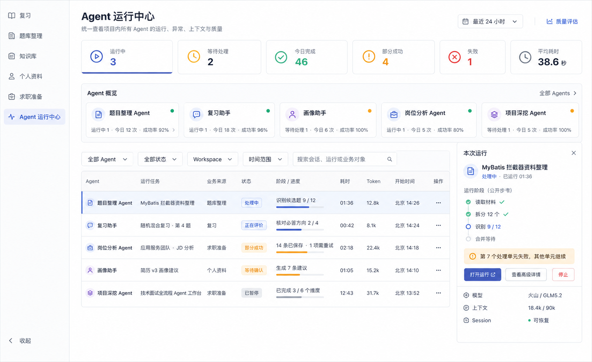
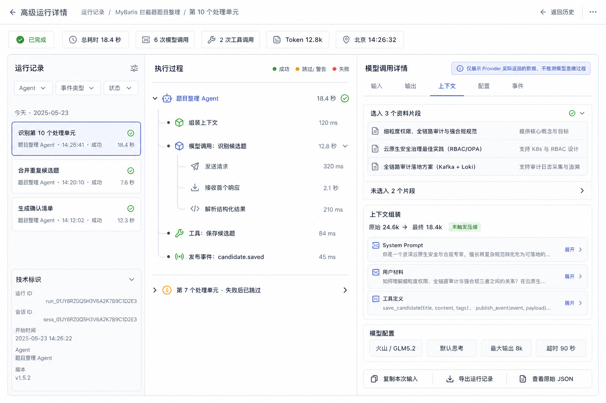
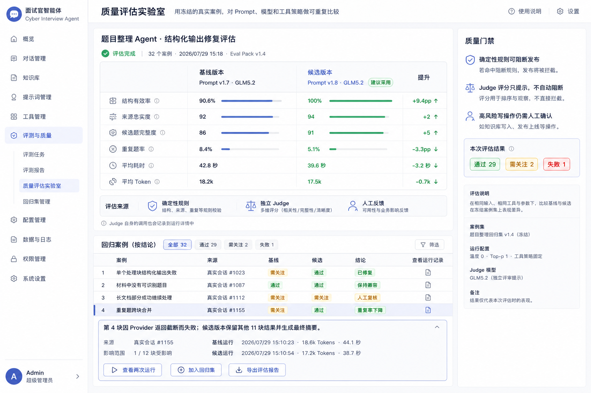

# Agent 可观测与质量评估工作台设计

- 日期：2026-07-29
- 状态：Confirmed design
- 适用范围：项目内全部 Runtime Agent、领域 Graph、模型调用、Tool 调用与受控写入流程
- 视觉基准：已确认的“Agent 运行中心 / 高级运行详情 / 质量评估实验室”三张高保真概念图
- 关联规范：
  - `2026-07-24-agent-conversation-workspace-guidelines.md`
  - `2026-07-24-application-workspace-layout-guidelines.md`
- 关联决策：
  - `2026-07-21-local-agent-jsonl-diagnostic-traces.md`
  - `2026-07-29-agent-trace-ledger-and-evaluation-boundaries.md`

## 0. 已确认的视觉参考

以下三张图是正式设计资产，不是临时灵感图：







实现时的优先级为：

1. 本文确认的产品规则、状态语义和数据契约；
2. 三张参考图的视觉层级、布局密度、阅读顺序和关键交互；
3. 现有 `frontend/src/app/global.css` 的颜色、字体、间距和圆角 Token；
4. 参考图中的示例数据与装饰性文字。

参考图中的模拟文案、数量和名称不构成业务契约。1440 宽实现必须与参考图并排核对；390、768、1024 需要独立响应式验收，不能简单缩小桌面布局。

## 1. 设计目的

Agent 的结果受模型、Prompt、上下文选择、Tool、Provider 状态和运行环境共同影响，天然存在不确定性。本项目不能只在失败后留下一个错误码，也不能把原始 JSONL 直接暴露给用户。

本设计建立三层产品能力：

```text
Agent 运行中心（全项目）
  → 高级运行详情（一次 Execution）
    → 质量评估实验室（跨版本、跨样本）
```

它们分别回答：

1. 现在有哪些 Agent 在运行，整体是否健康？
2. 某次运行实际发送、选择、调用和返回了什么？
3. 新 Prompt、模型或 Tool 策略是否真的比旧版本更好？

## 2. 目标与非目标

### 2.1 目标

- 统一覆盖题目整理、复习助手、画像助手、岗位分析、项目深挖和后续 Agent。
- 普通用户可看到业务阶段、进度、耗时、异常、恢复动作和输入来源。
- 高级查看可追溯实际 Prompt、消息、上下文、Tool、原始响应、结构化结果和事件流。
- 对真实失败样本进行可重复的离线回归和版本比较。
- 确定性规则可以形成质量门禁；主观 Judge 只提供证据和提示。
- Trace 失败不影响业务执行；评估失败不改变业务结果。
- 在本地优先、隐私可控的前提下，可选投影到 OTel、Langfuse 等外部系统。

### 2.2 非目标

- 不展示或推测 Provider 未返回的模型思维过程。
- 不把 Trace 当作业务真相、恢复状态或正式知识。
- 不允许 Judge 自动执行发布、删除或修改画像等高风险操作。
- 不建设第二套 Agent Runtime、消息系统或 Tool Gateway。
- 不用一个综合分数替代可解释的分项证据。
- 不要求普通用户理解 Session、Execution、Invocation 或 JSONL。

## 3. 查看模式与本地边界

### 3.1 普通查看

默认开放：

- Agent 名称、业务任务名和业务来源；
- 公开阶段、进度、开始时间、耗时和终态；
- 公开错误说明、部分成功摘要和下一步动作；
- Token、上下文占用的汇总值；
- 使用了哪些用户材料的友好名称；
- 当前 Execution 明确声明支持的暂停、停止、恢复、重试动作。

默认不开放：

- System Prompt 正文；
- 完整消息和材料正文；
- Tool 参数与结果正文；
- Provider 原始响应；
- 内部 ID、文件路径和原始 JSON。

### 3.2 高级诊断模式

当前产品没有用户、角色或权限系统，不虚构“管理员”“诊断权限”等概念。高级内容由本地开关控制：

```text
设置 → Agent 运行与诊断 → 高级诊断模式
```

- 默认关闭；
- 首次开启时明确提示其中可能包含简历、JD、回答、Prompt、Tool 参数和 Provider 原始响应；
- 配置保存在本地应用设置中，不写成账号权限；
- 关闭后只隐藏高级正文和高级配置，Trace 捕获继续运行；
- API 仍必须校验 `workspaceId`、资源归属和受控路径，前端开关不是安全边界；
- 质量结论和普通运行摘要保持可见；
- 普通模式允许人工触发已配置的 Judge；只有 Pack 原始定义、Judge 原始输入输出和高级运行参数需要开启高级诊断模式；
- Eval Pack 原始定义、原始 Trace、导出和高级评估配置仅在高级诊断模式下出现。

可查看：

- 实际发送的 System Prompt、消息、结构化 Schema 和模型参数；
- 上下文选择、排除、截断、压缩和 Offload 信息；
- Tool schema、参数、结果和安全错误；
- Provider 实际返回的原始响应与结构化结果；
- 产品事件、Runtime 事件、校验器与评估结果；
- Provider 实际返回的 reasoning/thinking 字段。

约束：

- API key、Cookie、Authorization、Token、secret ref 和 SDK client 永不保存。
- reasoning/thinking 仅在 Provider 真实返回时展示，并标记为“不稳定的 Provider 原始字段”。
- 页面固定显示：“仅展示 Provider 实际返回的数据，不推测模型思维过程。”
- 复制、导出和查看原始 JSON 都必须记录只含元数据的审计事件。

以后引入多用户或远程部署时，再把本地开关升级为真实权限；首版不得为尚不存在的账号系统预埋虚假体验。

## 4. 信息架构

### 4.1 一级入口

侧栏新增独立一级入口：

```text
Agent 运行中心
```

它与“复习、题库整理、知识库、个人资料、求职准备”同级，不能挂在任何单一业务子功能下。

### 4.2 页面关系

```text
Agent 运行中心
├─ 全局汇总
├─ Agent 概览
├─ Execution 统一列表
└─ 本次运行快速预览
     ├─ 打开业务运行
     └─ 查看高级详情
          ├─ 输入
          ├─ 输出
          ├─ 上下文
          ├─ 配置
          └─ 事件

质量评估
├─ 评估任务
├─ 版本比较
├─ 回归案例集
├─ 评估报告
└─ Eval Pack 查看与运行配置
```

运行中心不复制业务会话：

- “打开运行”回到原业务 Agent 页面；
- “高级详情”进入 Trace Explorer；
- 运行中心只展示任务摘要、状态、阶段、质量和诊断入口；
- 不在 Trace 页面发送业务消息；
- 各业务 Agent 页面提供回到对应运行详情的入口。

## 5. 核心概念与身份

### 5.1 层级

```text
Workspace
  └─ Session
      └─ Execution
          └─ Operation
              └─ Event
```

- `Session`：用户可恢复的会话或长期任务容器。
- `Execution`：一次开始、重试、恢复或继续运行。
- `Operation`：一次模型调用、Tool 调用、校验、领域写入或上下文组装。
- `Event`：Operation 内不可变的时间点记录。

列表一行统计一个顶层业务 `Execution`，不是每个子 Agent 调用各占一行。子 Agent、上下文摘要、标题生成、Judge、Embedding 和 Rerank 等系统组件进入该 Execution 的执行树；独立触发且不属于任何业务 Execution 的系统任务才作为单独运行出现。

### 5.2 用户名称与技术标识

主界面使用：

- `agentDisplayName`：题目整理 Agent；
- `executionTitle`：MyBatis 拦截器资料整理；
- `businessSource`：题库整理；
- 北京时间和状态。

UUID 只放在折叠的“技术标识”中，不能作为列表标题或主要搜索入口。

### 5.3 稳定身份

下一版支持完整 Operation 父子树的 Event 至少包含：

```json
{
  "schemaVersion": 3,
  "eventId": "...",
  "workspaceId": "...",
  "sessionId": "...",
  "executionId": "...",
  "operationId": "...",
  "parentOperationId": null,
  "agentRole": "question_generation",
  "agentName": "question_discovery",
  "eventType": "model.response",
  "occurredAt": "2026-07-29T06:26:41.123Z",
  "localOccurredAt": "2026-07-29T14:26:41.123+08:00",
  "timezone": "Asia/Shanghai",
  "payloadRef": "...",
  "summary": {}
}
```

排序与关联使用 UTC；用户展示统一转换为北京时间。

### 5.4 Trace 版本兼容

- 当前生产代码写入 `schema_version = 2`；
- Reader 必须兼容可能存在的 v1 历史记录，但不能宣称本地一定存在 v1 数据；
- 完整的 Execution → Operation → Event 父子树需要下一版 Trace Schema；
- v1/v2 只能按已知字段和时间顺序展示，不推测缺失的父子关系；
- 历史字段不足时标记“历史诊断信息不完整”；
- Eval Pack 依赖的字段缺失时结果为“证据不足”，不能伪造结论，也不重写历史 Trace。

### 5.5 Agent Observability Registry

所有业务 Agent 和会影响产品结果的系统模型组件必须注册稳定元数据：

```text
stable_name
display_name
business_route
component_type: business | system
capabilities: pause | resume | stop | retry
prompt_schema_versions
eval_pack_id
sensitivity
```

- 默认列表只显示用户可理解的业务 Agent；
- 开启“包含系统 Agent”筛选后，显示文本提取、上下文摘要、标题生成、Judge、Embedding、Rerank 等系统组件；
- AgentFactory 创建的 Agent 必须注册；
- 直接使用模型但不经过 AgentFactory、且会影响产品结果的系统组件同样必须注册；
- 未注册组件在开发启动或契约测试中失败，不能靠前端手写名单补漏；
- 新增 Agent 的验收必须包含运行中心可见、Trace 可下钻和 Eval Pack 绑定。

## 6. 总体后端架构

```text
Agent / Graph / Tool / Domain Service
        │
        ├─ Product Event Projector ──→ 业务 UI / SSE
        │
        └─ Unified Trace Capture
                 │
                 ▼
         Local Trace Ledger
         ├─ SQLite Query Index
         ├─ JSONL Full Bodies
         └─ Artifact References
                 │
        ┌────────┴────────┐
        ▼                 ▼
  Query / Stream API    Eval Engine
        │                 │
        ▼                 ▼
  三层产品界面       Eval Results / Cases
                 │
                 ▼
       可选 OTel / Langfuse 投影
```

### 6.1 现有能力复用

- 保留 `AgentTraceMiddleware` 捕获模型和 Tool 的真实交换。
- 保留 per-Execution JSONL 作为完整正文权威来源。
- 保留 Product Event 作为普通 UI 的安全投影。
- 保留 Usage Projection 作为业务侧 Token 与上下文汇总。
- 保留 OTel 为可选、元数据优先、fail-open 的外部投影。

### 6.2 新增 Trace Ledger

Trace Ledger 不是新 Runtime，而是现有 JSONL 的可查询索引与生命周期层：

- JSONL：完整、追加写、不可变正文；
- SQLite：可重建的查询索引和汇总；
- Artifact：超过正文阈值的大型 Tool 结果或附件引用。

SQLite 不复制完整敏感正文，只保存：

- 标识与父子关系；
- 人类可读标题；
- 时间、状态、耗时；
- Agent / Prompt / Tool / 模型 / Eval Pack 版本；
- Token、上下文、首 Token 耗时、总耗时和调用次数；
- 错误码和安全摘要；
- JSONL 文件、字节范围、正文 hash；
- 保留策略和删除状态。

索引损坏时可从 JSONL 重建；索引不是第二业务真相。

### 6.3 建议表

```text
trace_executions
trace_operations
trace_events
trace_artifacts
trace_retention_policies
eval_packs
eval_runs
eval_cases
eval_results
eval_feedback
```

所有表必须包含 `workspace_id`，所有查询必须先校验 Workspace 所有权。

### 6.4 业务汇总权威来源

运行中心使用统一 `ExecutionSummary` DTO：

- 业务状态、阶段、进度、部分成功和产物数量来自 `Execution + 领域任务汇总`；
- Token、上下文、模型调用、Tool 调用和耗时来自 Trace / Usage；
- Trace 负责解释发生了什么，不能反推业务是否完成；
- 前端不得通过累加 Event 计算业务总数；
- 部分成功只能由领域层持久化一次；
- 领域汇总和 Trace 摘要矛盾时显示诊断告警，不静默选择其一。

## 7. Trace 捕获契约

### 7.1 Execution

- `execution.started`
- `execution.paused`
- `execution.resumed`
- `execution.cancel_requested`
- `execution.completed`
- `execution.partial_success`
- `execution.failed`

### 7.2 上下文

- `context.assembly.started`
- `context.source.selected`
- `context.source.excluded`
- `context.truncated`
- `context.compacted`
- `context.offloaded`
- `context.assembly.completed`

每个来源记录稳定引用、友好名称、选择原因、字符/Token 数和处理方式，不在索引中保存全文。

### 7.3 模型

- `model.request`
- `model.first_token`
- `model.response`
- `model.error`

请求记录：

- Provider / model；
- reasoning effort；
- max output tokens；
- timeout / retry；
- PromptSpec ID 和版本；
- response schema；
- Tool schema；
- 实际消息与上下文正文引用。

响应记录：

- 原始响应；
- structured response；
- finish reason；
- input / output / reasoning / cached tokens（Provider 有则记录）；
- 首 Token 耗时和总耗时；
- Provider request ID；
- 安全错误信息。

### 7.4 Tool

- `tool.request`
- `tool.response`
- `tool.error`
- `tool.denied`
- `tool.budget_exhausted`

必须区分：

- 模型建议调用；
- Middleware 校验；
- 实际 handler 执行；
- 领域 Receipt。

### 7.5 校验与领域结果

- `validation.started`
- `validation.passed`
- `validation.failed`
- `domain.receipt.created`
- `artifact.created`
- `artifact.updated`

结构化输出失败不能被吞成普通模型失败；页面需要显示是 Provider、解析、Schema、业务校验还是写入失败。

## 8. API 设计

### 8.1 全局运行中心

```http
GET /api/agent-observability/summary
GET /api/agent-observability/agents
GET /api/agent-observability/executions
GET /api/agent-observability/executions/{executionId}
GET /api/agent-observability/executions/{executionId}/operations
GET /api/agent-observability/executions/{executionId}/events
GET /api/agent-observability/executions/{executionId}/stream
```

查询条件：

- workspaceId；
- agentName / agentRole；
- status；
- businessSource；
- sessionId；
- startedFrom / startedTo；
- search；
- cursor / limit。

列表必须基于游标分页，默认 50 条，最大 200 条。

### 8.2 高级正文

```http
GET /api/agent-observability/events/{eventId}/content
POST /api/agent-observability/events/{eventId}/copy-receipt
POST /api/agent-observability/executions/{executionId}/exports
```

- 正文接口与列表接口分离，避免列表意外加载大量私有内容。
- 正文默认折叠并按需读取。
- Artifact 使用受控流式响应，不返回本机路径。
- Trace 缺失或损坏返回可理解错误，不影响业务 Execution 页面。

运行控制继续调用原业务 Execution 的稳定命令，不新建控制状态机：

- 只有 Registry 声明支持的动作才显示按钮；
- 动作前展示影响摘要；
- 停止、暂停、恢复和重试复用原幂等键、状态机与 Receipt；
- 不支持的能力不显示，不能放一个点击后才报错的空按钮。

### 8.3 质量评估

```http
GET  /api/agent-evals/packs
POST /api/agent-evals/runs
GET  /api/agent-evals/runs
GET  /api/agent-evals/runs/{evalRunId}
GET  /api/agent-evals/runs/{evalRunId}/cases
POST /api/agent-evals/cases
POST /api/agent-evals/results/{resultId}/feedback
POST /api/agent-evals/executions/{executionId}/judge
```

创建评估任务必须冻结：

- 案例版本；
- Agent / Prompt / Schema / Tool 版本；
- 模型配置；
- Eval Pack 版本；
- 随机种子（Provider 支持时）；
- 运行环境摘要。

人工触发 Judge 时：

- 从 Execution 对应 Agent 自动选择 Eval Pack；
- 确认框展示评估范围、Pack 版本和预计模型调用次数，不展示费用；
- 不重新运行原业务 Agent；
- 以 `(executionId, packVersion, frozenInputHash)` 幂等复用结果，用户显式“重新评估”才创建新结果；
- Trace 不足或已按保留策略清理时，在调用模型前返回“证据不足”；
- Judge 失败可独立重试，不改变原业务状态。

### 8.4 Workspace 查询边界

- 默认查询当前 Workspace；
- 可显式切换 Workspace；
- “全部 Workspace”只展示安全汇总，不是默认值；
- 查看完整 Trace 前必须确认或切换到目标 Workspace；
- 运行控制只在单一 Workspace 选中时可用；
- 所有 API 和 SSE 都携带并校验 `workspaceId`；
- Workspace 删除同时清理 Trace 索引、正文、Artifact 和回归案例。

## 9. 实时与恢复

### 9.1 流式事件

运行中心使用 SSE 接收安全摘要：

- 新运行；
- 状态变化；
- 阶段变化；
- 计数进度；
- Token / context 汇总；
- 部分成功；
- 终态。

正文不通过全局 SSE 推送。

### 9.2 断线

- SSE cursor 可恢复；
- 断线后先拉取 Execution snapshot，再续接 stream；
- 页面刷新不能丢失正在运行项；
- 收到重复事件按 `eventId` 去重；
- 迟到事件不能覆盖更高版本状态。

### 9.3 部分成功

部分成功是一等状态，不等同失败：

```text
完成 11 / 12
失败 1
已保留 78 道候选题
可重试失败项
```

运行中心、业务页面和高级详情的计数必须来自同一 Execution 汇总投影。

## 10. 三个核心页面

### 10.1 Agent 运行中心

#### 页面职责

- 全项目 Agent 健康度；
- 所有运行中、等待处理、部分成功和失败任务；
- 快速打开业务页面或高级详情；
- 不展示大段 Trace 正文。

默认展示业务 Agent；“包含系统 Agent”打开后才把内部组件纳入筛选与统计。模型调用次数旁必须说明当前统计是否包含系统组件。

#### 桌面布局（1440）

```text
侧栏 240
┌────────────────────────────── 主内容 minmax(0,1fr) ─────────────────────────────┐
│ 标题 / 时间范围 / 质量评估入口                                                 │
│ 6 个全局汇总卡，单卡最小 148，高 92                                            │
│ Agent 概览，5 卡一行；不足宽度时横向内部滚动                                   │
│ 筛选栏                                                                         │
│ Execution 列表 minmax(0,1fr) │ 本次运行预览 clamp(300,24vw,340)                │
└────────────────────────────────────────────────────────────────────────────────┘
```

滚动归属：

- 页面 Shell 固定；
- Execution 列表内部纵向滚动；
- 右侧预览内部纵向滚动；
- 页面本身不产生横向滚动。

#### 状态语义

- 运行中：主色，不使用红色；
- 等待处理 / 等待确认：中性色或主色浅色；
- 部分成功 / 需关注：黄色；
- 已完成：绿色；
- 已暂停：灰色；
- 失败：红色；
- 取消：灰色并显示操作者。

#### 空状态

- 没有任何 Agent：解释需先启动业务任务；
- 当前筛选无结果：保留筛选条件并提供清除按钮；
- Trace 索引不可用：仍显示业务 Execution，标记“高级详情暂不可用”。

#### 快速动作

- 打开业务运行；
- 打开高级详情；
- 对本次运行人工发起 Judge；
- 按 Registry 能力停止、暂停、恢复或重试。

任何动作都必须有成功、失败和处理中反馈；能力不存在时不显示对应入口。

### 10.2 高级运行详情

#### 三栏布局（1440）

```text
运行索引 280–320 │ 执行树 minmax(420,1fr) │ 详情面板 minmax(480,42%)
```

三栏均有固定 Header 和独立滚动。选择 Event 只更新右栏，不重置执行树滚动位置。

#### 执行树

树节点统一结构：

```text
图标 + 标题 + 状态 + 耗时 + 展开按钮
```

必须支持：

- Agent / Operation / Event 层级；
- retry、fallback、跳过和部分成功分支；
- 当前运行节点实时更新；
- 键盘方向键浏览；
- 失败节点一键定位错误详情。

#### 详情 Tab

- 输入：Prompt、消息、Schema、Tool 定义；
- 输出：原始响应、结构化结果、解析状态；
- 上下文：选入、排除、截断、压缩、Offload；
- 配置：模型、reasoning、token、timeout、版本；
- 事件：按时间排序的原始 Event 摘要。

正文区域：

- 默认格式化显示；
- 可切换原始 JSON；
- 大于 200 KB 时虚拟化或分页；
- 长行可换行，代码块内部滚动；
- 复制有明确成功/失败反馈。

### 10.3 质量评估实验室

#### 页面职责

- 比较基线和候选版本；
- 判断是否退化；
- 解释差异来自哪些案例和指标；
- 将真实失败转成可重复的回归案例。

#### 评估层级

1. Invocation：结构、Schema、错误、Token、耗时；
2. Trajectory：Tool 选择、顺序、重试、循环和预算；
3. Outcome：业务结果是否完整、正确、可用；
4. Longitudinal：一段时间内的稳定性、耗时、Token 和人工修改率。

#### Eval Pack

共用质量内核：

- Schema validity；
- error / retry；
- latency / Token / context；
- Tool policy；
- trace completeness；
- human feedback。

角色专用 Pack：

- 题目整理：来源忠实度、完整度、重复率、零题兼容、部分成功；
- 复习评价：关键点覆盖、追问必要性、推进守卫；
- 画像助手：Evidence 对齐、冲突识别、写入边界；
- 岗位分析：JD 区域识别、要求原子性、背景排除；
- 项目深挖：问题深度、项目事实一致性、建议可执行性。

Eval Pack 必须有稳定 ID 和版本，结果不能脱离版本解释。

首版 Eval Pack 不提供任意 Prompt 编辑器：

- Pack 的维度、Judge Prompt、结构化 Schema 和版本在代码/Git 中定义；
- UI 只读展示 Pack 内容和版本；
- 设置页只允许启用、采样率、每日上限和 Judge 模型；
- 规则变化必须创建新版本并通过契约测试；
- 历史结果永久绑定原 Pack 版本；
- 自定义导入、复制和可视化编辑留待后续版本。

#### 评估策略

- 确定性规则：每次运行或关键路径同步执行；
- 在线异步评估：不阻塞用户结果；
- 独立 Judge：风险触发或采样执行；
- 离线回归：Prompt、模型、Tool 或 Schema 变更前执行；
- 人工反馈：记录采纳、修改、拒绝和原因。

自动 Judge 的确定策略：

- 确定性规则覆盖 100% 运行；
- 失败、部分成功、降级、用户拒绝或大幅修改结果自动触发 Judge；
- 普通成功运行按 Agent Pack 采样，默认 5%；
- 每 Workspace 每日自动 Judge 上限默认 20 次；
- 人工触发不受 5% 采样限制；
- 相同输入和 Pack 版本优先复用结果；
- 正常成功的内部辅助组件不递归触发 Judge。

Judge 约束：

- 使用独立 Prompt 和结构化输出；
- Judge 调用本身进入 Trace；
- 优先 pairwise 比较，不强依赖绝对分；
- 输出维度、证据、置信度和不确定项；
- Judge 失败为“未评估”，不能把业务结果改为失败。

Judge 是独立评分模型，不是业务 Agent 的自我反思。流程为：

```text
冻结业务输入 / 输出 / Trace / 版本
→ 确定性检查
→ 一次结构化 Judge 调用（默认）
→ 保存维度、证据、置信度和不确定项
→ 可选人工反馈
```

Judge 不获得领域写 Tool，不重跑业务 Agent，不写画像、题库、知识库或求职目标。Judge 自身调用也进入 Trace，但不会继续递归触发 Judge。

#### 人工反馈与回归案例

- Eval Result 不可被覆盖修改；
- 用户可标记“准确 / 错误 / 不确定”；
- 标记错误时选择维度并填写原因；
- Human Feedback 与 Judge 结果并存，趋势区展示 Judge–人工一致率；
- Feedback 可以生成“加入回归集”的建议，但不能自动修改 Eval Pack；
- 加入回归集前预览实际保存内容；
- 默认保存最小脱敏快照、预期不变量、来源 Trace 和版本信息；
- 含私有正文的案例必须显式标记；
- 回归案例独立于 90 天 Trace 保留策略，直到用户删除或 Workspace 删除；
- 修改或再次脱敏创建新案例版本，不重写历史；
- 外部投影默认不发送回归案例正文。

#### 版本比较隔离

评估实验室在独立 Evaluation Runtime 中运行：

- 输入是冻结只读快照；
- 写 Tool 替换为安全 Intent Recorder 或评估 Adapter；
- 结果只写 Eval 表与 Eval Artifact；
- 不生成正式候选、画像、知识或业务 Receipt；
- 必须测试写行为时使用临时事务或测试 Workspace，并在完成后回滚；
- UI 明确提示“评估不会影响正式数据”；
- Eval Trace 不允许恢复为生产业务 Execution。

#### 质量门禁

- 确定性 Schema、来源、Workspace 边界、Tool policy 可阻断发布；
- Judge 分数只提示、排序和要求人工复核；
- 高风险写操作继续由领域规则和 HITL 决定；
- Eval 服务不可用时业务 fail-open，发布门禁只保留确定性规则。

## 11. 视觉设计规范

### 11.1 现有 Token 为唯一基线

```css
--canvas: #f4f6f8;
--surface: #ffffff;
--surface-subtle: #f8fafc;
--surface-active: #eef2ff;
--text: #172033;
--text-muted: #5f6b7a;
--text-soft: #7b8794;
--border: #dfe4ea;
--border-strong: #c8d0da;
--primary: #4056b4;
--primary-hover: #34489a;
--primary-soft: #e8ecff;
--success: #13795b;
--success-soft: #e5f5ef;
--warning: #9a6700;
--warning-soft: #fff4d6;
--danger: #b42318;
--danger-soft: #feeceb;
--focus: #5b71d1;
```

禁止在新页面自行发明另一套蓝色、圆角、阴影或字体。

三张参考图约束视觉层级和布局密度；现有 Token 约束实际颜色、字号、间距、圆角与交互状态。参考图与 Token 冲突时，以 Token 和本文状态语义为准。

### 11.2 字体与数字

- 正文：14–16px，行高 1.5–1.65；
- 页面标题：24px；
- 区块标题：16–18px；
- 标签和元数据：12–13px，不小于 12px；
- 运行计数、时间、Token 使用 `font-variant-numeric: tabular-nums`；
- 代码与 JSON 使用 `--font-mono`。

### 11.3 间距与尺寸

- 4px 基础间距；
- 页面内容间距优先 16 / 20 / 24 / 32；
- 普通圆角 6px，容器圆角 8px；
- 触控目标不小于 44×44；
- 固定 Header 不小于 58px；
- 筛选控件高 36–40px；
- 状态卡高 88–96px；
- 表格行高 56–72px。

### 11.4 颜色原则

- 主色表示当前、运行、选中和主要操作；
- 绿色只表示已经成功；
- 黄色表示可继续但需关注；
- 红色只表示失败、不可逆危险操作或阻断；
- 灰色表示等待、暂停、取消和次要信息；
- 不能只靠颜色表达状态，必须同时有文字和图标。

### 11.5 禁止项

- 不使用渐变作为主要容器背景；
- 不使用大面积阴影和悬浮卡片堆叠；
- 不把运行中画成红色；
- 不在普通用户界面出现 UUID、文件路径或 JSON；
- 不为每个数据点创建独立大卡片；
- 不让固定按钮覆盖正文；
- 不依赖整个页面滚动找到主要操作。

## 12. 响应式规范

### 1440 及以上

- 完整三栏；
- 全局汇总一行；
- 右栏默认打开；
- 主内容不超过可读范围，但运行中心允许使用全部可用宽度。

### 1024–1439

- 运行中心右侧预览默认收起为 44–52px rail；
- 高级详情左侧运行索引可收起；
- 详情面板保持至少 420px；
- 全局汇总改为 3×2。

### 768–1023

- 两栏变为“主区 + 抽屉”；
- Agent 概览水平内部滚动；
- 列表隐藏低优先级列，使用行内详情；
- 高级详情执行树为主，详情使用全高抽屉。

### 390–767

- 单列；
- 顶部汇总为 2 列；
- 筛选使用底部 Sheet；
- Execution 行显示 Agent、标题、状态、进度、耗时；
- 高级详情在“执行过程 / 详情”两个页签间切换；
- 不展示桌面三栏压缩版；
- 不能产生页面级横向滚动。

验收宽度固定为 390、768、1024、1440。

## 13. 状态、错误与降级

| 场景 | 产品行为 |
|---|---|
| Trace 写盘失败 | 业务继续；运行中心显示“部分诊断信息缺失” |
| SQLite 索引损坏 | 从 JSONL 重建；重建期间仍可显示业务 Execution |
| JSONL 某行损坏 | 跳过损坏行并标记缺口，不丢弃整个文件 |
| 正文已过保留期 | 保留元数据，显示“详细内容已按保留策略清理” |
| SSE 断线 | snapshot + cursor 恢复 |
| Eval Engine 失败 | 业务继续，状态为“未评估” |
| Judge 超时 | 不重试业务 Agent；可单独重试评估 |
| Provider 未返回 thinking | 不显示该区块 |
| 部分成功 | 展示完成、失败、保留和可重试数量 |
| Workspace 已删除 | 按 Workspace 生命周期清理索引和正文 |

## 14. 保留与隐私

默认策略：

- 汇总元数据长期保留；
- 完整 Trace 正文保留 90 天；
- Artifact 与正文同步过期；
- 用户可配置永久保留、定期清理或不保存正文；
- 清理使用可恢复队列和 Receipt，不在请求线程大批量删除；
- 清理后索引保存 hash、大小、时间和清理原因。

Workspace 删除优先于普通保留策略。

不允许：

- 将完整正文默认发送到远程 OTel / Langfuse；
- 在浏览器持久缓存 Trace 正文；
- 使用公开 URL 暴露 Artifact；
- 将 Trace 内容写入知识库或 LLM Wiki。

### 14.1 模型调用覆盖

只要模型调用会影响产品结果，就必须进入 Trace：

- 业务 Agent 调用；
- 标题生成、上下文摘要、结构化分类；
- 参与检索决策的 Embedding / Rerank；
- Judge 和其他评估模型。

设置页的模型连通性测试、健康探测等诊断调用进入独立 Diagnostics 分类，不计入业务 Execution 调用数。

## 15. 性能预算

- 运行中心首屏 P95：本地数据不超过 800ms；
- 列表筛选 P95：不超过 300ms；
- 打开 Execution 摘要 P95：不超过 500ms；
- 加载单 Event 正文 P95：不超过 800ms（不含大型 Artifact）；
- Trace 捕获对一次模型调用新增同步开销目标小于 10ms；
- JSONL 写入与索引更新失败均 fail-open；
- 列表和执行树必须虚拟化或游标分页，不能一次渲染全部历史。

## 16. 可访问性

- 所有状态图标有可访问名称；
- 树控件遵循 `tree/treeitem` 键盘语义；
- Tab、抽屉和折叠 rail 切换后管理焦点；
- 颜色对比满足 WCAG AA；
- 动效 150–300ms，并尊重 `prefers-reduced-motion`；
- 实时进度使用节制的 `aria-live="polite"`，不能每秒朗读计时。

## 17. 验收标准

### 17.1 全局覆盖

- 同一页面可筛选至少五类 Agent；
- 从任意 Execution 可打开对应业务页面和高级详情；
- 新增 Agent 只需注册展示元数据与 Eval Pack，不复制页面。
- 默认只显示业务 Agent，打开“包含系统 Agent”后可定位系统组件；
- 顶层业务 Execution 不因内部调用多个 Agent 而重复计数。

### 17.2 Trace 完整性

- 模型请求、响应、错误成对可追溯；
- Tool 请求、响应、错误成对可追溯；
- 上下文来源能说明选入、排除与处理方式；
- Prompt / Schema / Tool / model / Eval Pack 版本可定位；
- Trace 缺失不会让业务页面 500。

### 17.3 页面

- 390 / 768 / 1024 / 1440 无横向溢出；
- Header、筛选和主要操作不随长内容消失；
- 三栏各自滚动，整个页面不被某一栏无限撑高；
- 10,000 条 Execution 和 1,000 个 Event 的测试数据仍可操作；
- 所有用户可见时间为北京时间，耗时使用单调时间或时间差。

### 17.4 评估

- 可冻结真实失败为回归案例；
- 同一案例可比较基线和候选；
- 结果展示分项证据而非只有总分；
- Judge 失败不会阻断业务；
- 确定性规则、Judge 和人工反馈来源清晰区分；
- 可从评估案例下钻到两次运行详情。
- 可人工触发 Judge 且不会重跑业务 Agent；
- Judge 结果可记录人工纠错并形成版本化回归案例；
- 版本比较不会写入正式业务数据。

## 18. 实施边界与顺序

分四个纵向、可独立验收的 Slice：

1. 真实 Trace → 索引 → 查询 API/SSE → Agent 运行中心 → 单次高级详情的只读闭环；
2. 高级正文、本地高级诊断开关、复制与导出；
3. 真实 Eval Pack、人工 Judge、回归案例和版本比较；
4. 保留策略、外部投影与长期质量趋势。

每个 Slice 都必须同时完成后端、前端、失败状态、定向测试和最小浏览器验收，不能先造只有静态数据的页面，也不能先建没有用户入口的后台。

### 18.1 每个 Slice 的完成门禁

- 为 Registry 中每类 Agent 提供确定性 Trace fixture；
- 至少覆盖批处理 Agent、对话 Agent 和 Tool Agent 三条真实路径；
- SSE、刷新恢复、部分成功和 Trace 缺失必须使用真实后端数据验证；
- 1440 页面与三张参考图并排比较并保存截图；
- 390、768、1024 验证响应式、滚动归属和无横向溢出；
- 浏览器验证筛选、复制反馈、返回、空状态和全部可见按钮；
- Mock-only、静态页面或点击无反应的按钮不能记为完成；
- 只在代表性路径使用真实 Provider，不为所有 Agent 重复消耗模型 Token。

### 18.2 产品成熟度边界

首个 Slice 完成后，产品只能声称“全局运行可查看、单次执行可追溯”；直到第三个 Slice 完成，才可以声称“具备可重复的 Agent 质量评估闭环”。外部 OTel/Langfuse、长期趋势和自定义 Eval Pack 均不属于首版承诺。
